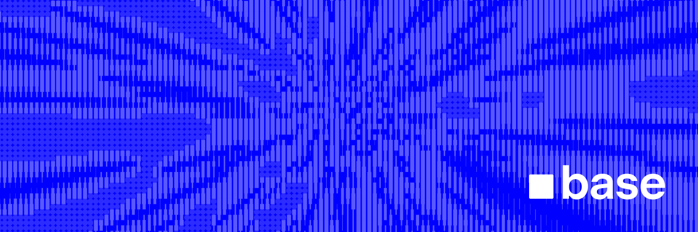

# Base Reth Node

> [!WARNING]
> This repository is for development purposes. For production deployments, please use the releases referenced in [base/node](https://github.com/base/node/releases).

Base Reth Node is an implementation of a Reth Ethereum node, specifically tailored for the Base L2 network. It integrates Flashblocks capabilities and leverages Optimism components from Reth `v1.8.1`. This node is designed to provide a robust and efficient solution for interacting with the Base network.

<!-- Badge row 1 - status -->

[](https://github.com/base/node-reth/graphs/contributors)
[](https://github.com/base/node-reth/graphs/contributors)
[](https://github.com/base/node-reth/stargazers)

[](https://github.com/base/node-reth/blob/master/LICENSE)

<!-- Badge row 2 - links and profiles -->

[](https://base.org)
[](https://base.mirror.xyz/)
[](https://docs.base.org/)
[](https://base.org/discord)
[](https://twitter.com/Base)

<!-- Badge row 3 - detailed status -->

[](https://github.com/base/node-reth/pulls)
[](https://github.com/base/node-reth/issues)

## Features

- **Base L2 Support:** Optimized for the Base Layer 2 network.
- **Flashblocks RPC:** Includes a `flashblocks-rpc` crate for Flashblocks.
- **Reth Based:** Built upon Reth `v1.8.1`, incorporating Optimism features.
- **Dockerized:** Comes with a `Dockerfile` for easy containerization and deployment.
- **Development Toolkit:** Includes a `justfile` for streamlined build, test, and linting workflows.

## Node Operators

> [!IMPORTANT]
> This repository is for development of the client. For docker images and configurations, see the [node repository](https://github.com/base/node) and the
> [node-reth image](https://github.com/base/node/pkgs/container/node-reth). This image bundles vanilla Reth and Base Reth and can be toggled with
> `NODE_TYPE=base` or `NODE_TYPE=vanilla`

## Repository Structure

```
.
├── Cargo.toml        # Rust workspace and package definitions
├── Cargo.lock        # Dependency lockfile
├── Dockerfile        # For building the Docker image
├── LICENSE           # MIT License
├── README.md         # This file
├── crates/
│   ├── node/         # Main node application logic
│   ├── transaction-tracing/ # Transaction tracing utilities
│   └── flashblocks-rpc/ # RPC server for Flashblocks integration
├── justfile          # Command runner for development tasks
└── .github/
    └── workflows/
        └── ci.yml    # GitHub Actions CI configuration
```

## Prerequisites

- **Rust:** Version 1.85 or later (as specified in `Cargo.toml`). You can install Rust using [rustup](https://rustup.rs/).
- **Just:** A command runner. Installation instructions can be found [here](https://github.com/casey/just#installation).
- **Docker:** (Optional) For building and running the node in a container. See [Docker installation guide](https://docs.docker.com/get-docker/).
- **Build Essentials:** `git`, `libclang-dev`, `pkg-config`, `curl`, `build-essential` (these are installed in the Docker build process and may be needed for local builds on some systems).

## Getting Started

### 1. Clone the Repository

```bash
git clone https://github.com/base/node-reth.git
cd node-reth
```

### 2. Build

You can build the project using the `justfile` for a release build:

```bash
just build
```

Alternatively, if performance is critical, you can build with all optimizations enabled + jemalloc:

```bash
just build-maxperf
```

Otherwise, you can use Cargo directly:

```bash
cargo build --release --bin base-reth-node
```

The main binary will be located at `target/release/base-reth-node`.

### 3. Run Checks and Tests

To ensure everything is set up correctly, run the checks and tests:

```bash
just check  # Runs cargo fmt --check and cargo clippy
just test   # Runs cargo test
```

To automatically fix formatting and clippy warnings:

```bash
just fix
```

To run linting checks:

```bash
just lint
```

## Running the Node

To run the compiled node:

```bash
./target/release/base-reth-node [OPTIONS]
```

To see available command-line options and subcommands, run:

```bash
./target/release/base-reth-node --help
```

_(Note: Replace `[OPTIONS]` with the necessary configuration flags for your setup. Refer to the `--help` output for details.)_

## Docker

### 1. Build the Docker Image

```bash
docker build -t base-reth-node .
```

### 2. Run the Docker Container

```bash
docker run -it --rm base-reth-node [OPTIONS]
```

_(Note: You might need to map ports (`-p`), mount volumes (`-v`) for data persistence, or pass environment variables (`-e`) depending on your node's configuration needs.)_

## Configuration

_(Details about specific configuration files, environment variables, or command-line arguments required for typical operation will be added here as the project evolves. For now, please refer to the `--help` output of the binary.)_

## License

This project is licensed under the MIT License. See the [LICENSE](LICENSE) file for details.
