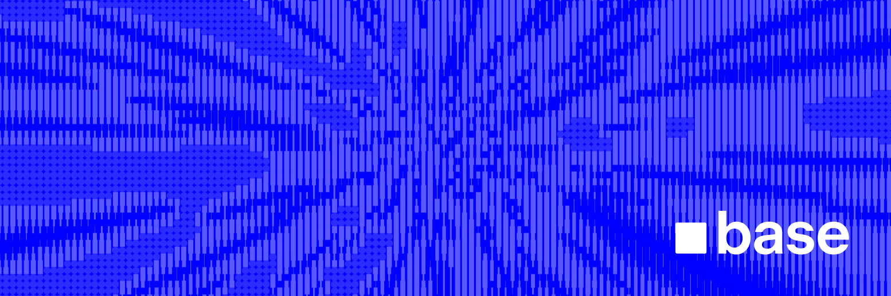

# Base

Base is a rollup built on Ethereum.

## Why Base
- **Cheap, fast, and open platform:** Base is a globally available platform that provides 1-second and <1-cent transactions to anyone in the world.
- **Reach more users:** Base is committed to helping developers grow their user base by distributing their apps through official Base channels.
- **A place to earn:** Base has delivered grants to more than 1,000 builders, with plans to continue supporting more.
- **Access to high-quality tooling:** Builders have access to tools to build incredible onchain experiences for AI, social, media, and entertainment.

## Learn More

- Visit the [docs](https://docs.base.org) for information on how to:
    - [Connect your wallet](https://docs.base.org/base-chain/quickstart/connecting-to-base)
    - [Run a node](https://docs.base.org/base-chain/node-operators/run-a-base-node)
    - [Deploy an app](https://docs.base.org/base-chain/quickstart/deploy-on-base)
- The [specs](https://specs.base.org) site has an overview of the protocol, including past and upcoming upgrades.

## Install Binaries

Use [`baseup`](baseup/README.md) to install the GitHub release binaries for this repository:

```bash
curl -fsSL https://raw.githubusercontent.com/base/base/main/baseup/install | bash
```

## Run a Node

This repository now hosts the public Base node previously published from [`base/node`](https://github.com/base/node). Root `docker-compose.yml` pulls `ghcr.io/base/node-reth`. Pass `--build` to compile this tree. `just devnet up` is the local developer stack.

1. Set `BASE_NODE_L1_ETH_RPC` and `BASE_NODE_L1_BEACON` in `.env.mainnet` or `.env.sepolia`.
2. Start the node:

```bash
# Mainnet (default):
docker compose up --build

# Testnet:
NETWORK_ENV=.env.sepolia docker compose up --build

# Pin a published image (no compile):
NODE_TAG=v1.2.6 docker compose up
```

See the [docs](https://docs.base.org/base-chain/node-operators/run-a-base-node) for hardware requirements, snapshots, Flashblocks, and historical proofs.

## Base Anvil Package

Every push to `main` publishes patched `anvil` and `forge` binaries to GHCR
as `ghcr.io/base/base-anvil`. Use immutable `sha-<commit>` tags for pinned
downstream tests, or `main` for the latest successful `main` build.

## License

Licensed under [MIT](LICENSE).
