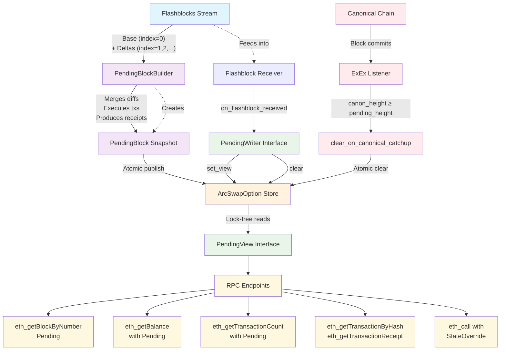

# Flashblocks — Real-time Pending Block Indexer (with ExEx)

Flashblocks maintains a real-time snapshot of the next block being built, assembled from incoming “flashblock” chunks.
It lets RPC clients query that pending block—transactions, receipts, balances, nonces, and `eth_call` state overrides—before it becomes canonical.

An Execution Extension (ExEx) watches the canonical chain and clears the pending snapshot as soon as `canon_height ≥ pending_height`, so stale data is never served.

Our north star ([#51]):

> Invalidate Flashblocks when canonical blocks are more recent.
> Connect `FlashblocksState` to the canonical state stream and clear pending when we have a canonical block with an equal or higher block number. This makes outages gracefully degrade to canonical-only reads.

---

## What this repository provides

- Ingestion: Subscribe to flashblocks and build an in-memory snapshot (“PendingBlock”).
- Read API (PendingView): RPC reads pending block/tx/receipt/balances/nonce and `eth_call` overlays via a read-only trait.
- Write API (PendingWriter): Flashblock receiver publishes/clears snapshots atomically.
- Automatic clearing via Execution Extensions (ExEx): A lightweight listener that clears the snapshot when `canon_height ≥ pending_height`.

---

## Architecture (stream → assemble → expose → clear)

```
[Flashblocks stream] → [PendingBlockBuilder] → [ArcSwapOption<Arc<…>> store]
                                              ↑                         ↓
                                  publish/clear via PendingWriter   RPC reads via PendingView
```

- Mermaid diagram



- Stream: flashblock chunks arrive (base index=0; then 1,2,…).
- Assemble: `PendingBlockBuilder` merges diffs, executes txs, produces receipts and state overrides.
- Expose: publish a snapshot implementing `PendingView` (read-only).
- Clear: ExEx listens to canonical commits and calls `clear_on_canonical_catchup`.

### Data lifecycle (at a glance)

- Ingest flashblock base and deltas
- Build/replace `PendingBlock` snapshot
- Serve Pending RPC reads from the snapshot
- Clear snapshot when `canon_height ≥ pending_height` (via ExEx)

### Staleness risk (and how we prevent it)

- Without ExEx catch-up clear, Pending RPC paths can continue serving the last snapshot even after canonical has advanced (stale risk).
- With ExEx installed, `clear_on_canonical_catchup(canon)` ensures that when `canon ≥ pending_height`, the snapshot is dropped and Pending RPC returns `None` (or falls back to canonical).

---

## Read/Write traits

### Read-only: `PendingView`

```rust
pub trait PendingView: Send + Sync {
    fn block_number(&self) -> BlockNumber;
    fn flashblock_index(&self) -> u64;

    fn get_block(&self, full: bool) -> RpcBlock<Optimism>;
    fn get_receipt(&self, tx_hash: TxHash) -> Option<OpTransactionReceipt>;
    fn get_transaction_by_hash(&self, tx_hash: TxHash) -> Option<Transaction>;
    fn get_transaction_count(&self, address: Address) -> U256;
    fn get_balance(&self, address: Address) -> Option<U256>;
    fn get_state_overrides(&self) -> Option<StateOverride>;
}
```

### Write-only: `PendingWriter`

```rust
pub trait PendingWriter {
    /// Called when a new Flashblock chunk arrives (receiver path).
    fn on_flashblock_received(&self, fb: Flashblock);

    /// Atomically publish a new snapshot.
    fn set_view(&self, pb: PendingBlock);

    /// Atomically clear the snapshot.
    fn clear(&self);

    /// Clear if canonical height >= pending height.
    fn clear_on_canonical_catchup(&self, canon: u64);
}
```

`FlashblocksState<Client>` implements both traits and internally uses
`ArcSwapOption<…>` for lock-free reads and atomic swaps/clears.

Note on design:

- `PendingView` and `PendingWriter` are internal boundaries to clarify read vs write responsibilities.
- In production, RPC handlers use `FlashblocksState` directly; in tests we also expose trait-object handles for targeted assertions.

---

## Execution Extension (ExEx): canonical catch-up

We hook into Reth’s ExEx notifications to clear pending the moment canonical commits reach or exceed it.

```rust
// Installed in main.rs via .install_exex_if(...)
.install_exex_if(flashblocks_enabled, "flashblocks-canon", {
    let fb_cell = fb_cell.clone();
    move |mut ctx| async move {
        use futures_util::TryStreamExt;
        use reth_exex::ExExEvent;

        let fb = fb_cell
            .get_or_init(|| Arc::new(FlashblocksState::new(ctx.provider().clone())))
            .clone();

        Ok(async move {
            while let Some(note) = ctx.notifications.try_next().await? {
                if let Some(committed) = note.committed_chain() {
                    for b in committed.blocks_iter() {
                        // canonical ≥ pending → clear
                        fb.clear_on_canonical_catchup(b.number);
                    }
                    let _ = ctx.events.send(ExExEvent::FinishedHeight(
                        committed.tip().num_hash(),
                    ));
                }
            }
            Ok(())
        })
    }
})
```

Runtime behavior: You do not call `clear_on_canonical_catchup` manually; ExEx does it automatically whenever canonical blocks are committed.

Test behavior: In tests that don’t spin up ExEx, you simulate the catch-up:

```rust
node.writer.clear_on_canonical_catchup(1);
```

---

## RPC behavior (what gets served)

- `eth_getBlockByNumber(Pending)`: returns the pending snapshot if present; `None` if cleared.
- `eth_getBalance` (with `Pending`): pending override if present, else canonical.
- `eth_getTransactionCount` (with `Pending`): canonical latest + pending increments.
- `eth_getTransactionByHash`/`eth_getTransactionReceipt`: prefer pending snapshot first; canonical fallback.
- `eth_call` (with `Pending`): applies pending `StateOverride` overlay if snapshot exists.

---

## Tests (guide)

We test both the happy path (pending is served) and the catch-up clear:

```rust
#[tokio::test]
async fn test_canonical_catchup_clears_pending() -> eyre::Result<()> {
    // 1) Seed pending block #1 (base + delta)
    node.send_payload(create_first_payload()).await?;
    node.send_payload(create_second_payload()).await?;

    // 2) Pending exists
    let pb = provider.get_block_by_number(BlockNumberOrTag::Pending).await?.unwrap();
    assert_eq!(pb.number(), 1);

    // 3) Simulate canon ≥ pending and clear
    node.writer.clear_on_canonical_catchup(1);

    // 4) Pending is gone (RPC falls back to canonical)
    assert!(provider.get_block_by_number(BlockNumberOrTag::Pending).await?.is_none());
    Ok(())
}
```

And we document the opposite (no ExEx, no clear → snapshot lingers):

```rust
#[tokio::test]
async fn test_without_catchup_pending_is_stale() -> eyre::Result<()> {
    node.send_payload(create_first_payload()).await?;
    node.send_payload(create_second_payload()).await?;
    // No clear_on_canonical_catchup here → pending still served
    assert!(provider.get_block_by_number(BlockNumberOrTag::Pending).await?.is_some());
    Ok(())
}
```

---

## Wiring in `main.rs` (summary)

- Single shared state (`OnceCell`) used by both ExEx and RPC.
- ExEx listens for canonical commits and calls `clear_on_canonical_catchup`.
- Subscriber feeds flashblocks into `on_flashblock_received`.
- RPC exposes pending reads using the same state.

(You already have this, but that’s the mental model.)

---

## Why this works well

- Low latency: In-memory, lock-free reads (`ArcSwapOption::load_full()`).
- Clear separation: `PendingView` (reads) vs `PendingWriter` (writes).
- Graceful degradation: When ExEx clears, pending RPC paths fall back to canonical automatically.
- Composability: Any snapshot that implements `PendingView` can be hot-swapped in.

---

## Does the code ever serve outdated flashblocks?

- If ExEx is installed and running, we clear as soon as canonical catches up; the pending snapshot will not be served after that.
- If ExEx is not running (or not wired in tests), the snapshot remains in memory and will be served for `Pending` queries until a new base flashblock arrives or you clear it.

To be 100% sure in your tree, search for:

- all `get_*` calls on `FlashblocksState` in `rpc.rs` (they prefer pending if present),
- all places that call `clear_on_canonical_catchup` (should be the ExEx),
- and any direct `store(None)`/`swap(None)` that clear pending.

---

# Future work: real-data test harness

Today our tests use small synthetic flashblocks to exercise the pipeline (builder → snapshot → RPC) and the ExEx catch-up clear. That’s great for coverage and speed, but we should also validate with real Flashblock payloads captured from the live websocket.

## Compressed plan

1) Record a small corpus of real flashblocks (NDJSON) from the websocket
2) Replay into `on_flashblock_received` via a simple `replay_flashblocks(...)` helper
3) Use a mock/recorded provider to supply headers/state deterministically
4) Assert golden outputs for block/tx/receipt/state-overrides and `eth_call(Pending)`
5) Verify ExEx catch-up clears the snapshot (Pending → None)

See `docs/realdata-tests.md` (to be added) for the detailed step-by-step.


