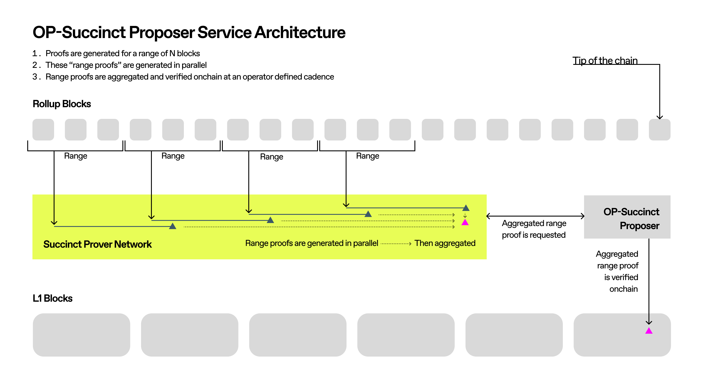

# Architecture

## Prerequisites

Every OP Stack rollup is composed of four main components.

- `op-geth`: Takes transactions from users and uses them to generate blocks and execute blocks.
- `op-batcher`: Batches transactions from users and submits them to the L1.
- `op-node`: Reads batch data from L1 and uses it to drive `op-geth` in non-sequencer mode to perform state transitions.
- `op-proposer`: Posts an output root to L1 at regular intervals, which captures the L2 state so withdrawals can be processed.

You can read more about the components in the [OP Stack Specification](https://specs.optimism.io/).

## OP Succinct

OP Succinct is a lightweight upgrade to the OP Stack that allows the chain to progress only with ZK-proven blocks, while keeping the other components (`op-geth`, `op-batcher`, and `op-node`) unchanged. Deploying OP Succinct requires deploying one contract, `OPSuccinctL2OutputOracle`, and spinning up a lightweight modification to the `op-proposer` that requests proofs to be submitted to the L1 contract.

Here is a high-level overview of the new components that are introduced in OP Succinct:

- **Range Program.** A program that derives and executes batches of blocks. The program is written in Rust and designed to be executed inside the zkVM.
- **Aggregation Program.** Aggregates proofs of range programs to reduce on-chain verification costs. This program is also written in Rust and designed to be executed inside the zkVM.
- **OP Succinct L2 Output Oracle.** A solidity smart contract that contains an array of L2 state outputs, where each output is a commit to the state of the L2 chain. This [contract](https://github.com/ethereum-optimism/optimism/blob/3e68cf018d8b9b474e918def32a56d1dbf028d83/packages/contracts-bedrock/src/L1/L2OutputOracle.sol) already exists in Optimism's original system but is modified to verify proofs as the authentication mechanism.
- **OP Succinct Proposer.** Observes the posted batches on L1 and controls the proving of the range and aggregation programs.

