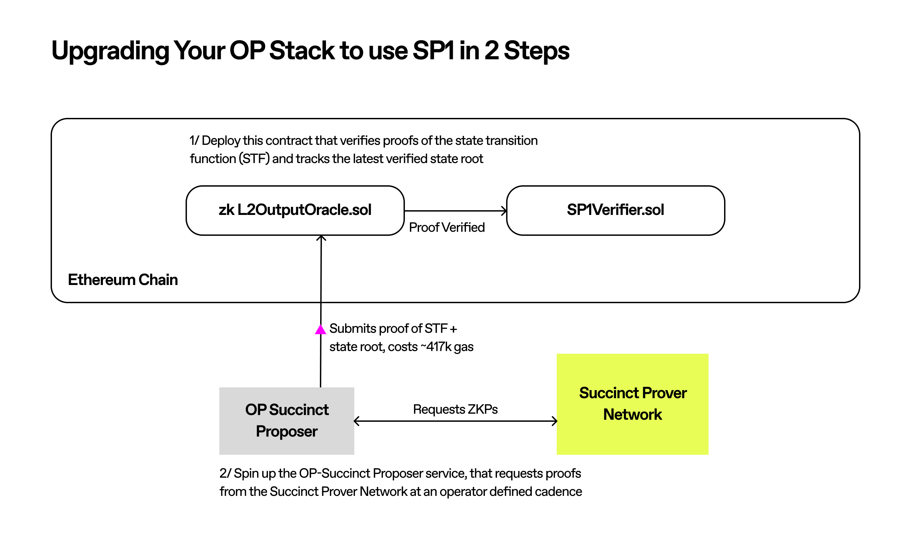

# Getting Started

In this section, we'll guide you through upgrading an existing OP Stack chain to a [fully type-1 ZK rollup](https://vitalik.eth.limo/general/2022/08/04/zkevm.html) using SP1 and OP Succinct. 

The steps are the following:
1) **Deploy the OP Succinct L2 Output Oracle Contract.** This contract is a modified version of the existing `L2OutputOracle` contract that uses SP1 to verify the execution and derivation of the L2 state transitions.
2) **Start the OP Succinct Proposer.** This service is a modified version of the existing `op-proposer` service. It posts output roots to the L2 Output Oracle contract at regular intervals by orchestrating the generation and aggregation of proofs.
3) **Update your OP Stack Chain Configuration.** You will need to update your configuration to update the `L2OutputOracle` contract to the new implementation using your `ADMIN` key.

