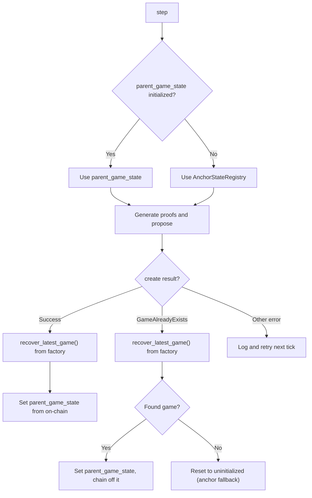

# `base-proposer`

<a href="https://github.com/base/base/actions/workflows/ci.yml"></a>
<a href="https://github.com/base/base/blob/main/LICENSE"></a>

TEE-based output proposer for Base.

## Overview

- **Output Proposer**: L1 transaction submission via `OutputProposer` (local and remote signing modes). Shared contract bindings (dispute game factory, anchor state registry, aggregate verifier) are provided by [`base-proof-contracts`](../contracts/).
- **RPC**: Async clients for L1, L2, and rollup node communication with caching.
- **Enclave**: TEE enclave client for stateless block validation and proof aggregation.
- **Prover**: Core prover for generating TEE-signed proposals.
- **Driver**: Coordination loop for proposal generation and submission.
- **Metrics**: Prometheus metric definitions and recording.
- **CLI**: Command-line argument parsing and configuration validation.

## Architecture

### End-to-End Flow

```text
L2 RPC (Reth) ──► Proposer ──► TEE Enclave
Rollup RPC        │                │
L1 RPC            │                │ Signed proposal
                  │                ▼
                  │         Proposer verifies
                  │         output root locally
                  ▼
           DisputeGameFactory.createWithInitData()
                  │
                  ▼
           AggregateVerifier + TEEVerifier
           (on-chain verification)
```

1. The proposer fetches L2 block data, execution witnesses, and L1 origin headers from RPC nodes.
2. It sends this data to the TEE enclave, which performs stateless EVM execution and returns a signed output root.
3. The proposer independently recomputes the output root and rejects mismatches.
4. It gates proposals on the rollup RPC's `safe_l2`/`finalized_l2` and checks for reorgs.
5. It submits the proof to L1 via `DisputeGameFactory.createWithInitData()`, where `AggregateVerifier` and `TEEVerifier` verify it on-chain.

### Game Tracking and Parent Selection

Each dispute game references a parent game via `parentIndex` in the factory. The proposer determines its starting point (parent game) using on-chain discovery:



#### Key Scenarios

| Scenario | Parent source | Parent index |
|---|---|---|
| First run, no games exist | `AnchorStateRegistry.getAnchorRoot()` | `NO_PARENT_INDEX` (0xFFFFFFFF) |
| Startup with existing games | Most recent game of correct type (any proposer) | That game's factory index |
| After creating a game | On-chain scan for latest game of our type | Discovered game's factory index |
| After `GameAlreadyExists` | On-chain scan for latest game of our type | Discovered game's factory index |
| On-chain scan finds nothing | `AnchorStateRegistry.getAnchorRoot()` | `NO_PARENT_INDEX` |

The `recover_latest_game()` method walks backwards through the `DisputeGameFactory` (up to `MAX_GAME_RECOVERY_LOOKBACK` entries) to find the most recent game matching the configured `game_type`. This allows the proposer to chain off games created by any proposer, not just itself.

#### Data Sources

| Component | Source | Purpose |
|---|---|---|
| L2 blocks | L2 RPC (Reth) | Block data, execution witnesses, storage proofs |
| Sync status | Rollup RPC (op-node) | `safe_l2` / `finalized_l2` for proposal gating |
| Chain config | Rollup RPC (op-node) | `optimism_rollupConfig` for genesis and rollup params |
| L1 data | L1 RPC | L1 origin headers, receipts, blockhash verification |
| Anchor state | L1 contracts | `AnchorStateRegistry` for starting root when no parent game exists |
| Game discovery | L1 contracts | `DisputeGameFactory` for finding existing games to chain off |

## License

[MIT License](https://github.com/base/base/blob/main/LICENSE)
