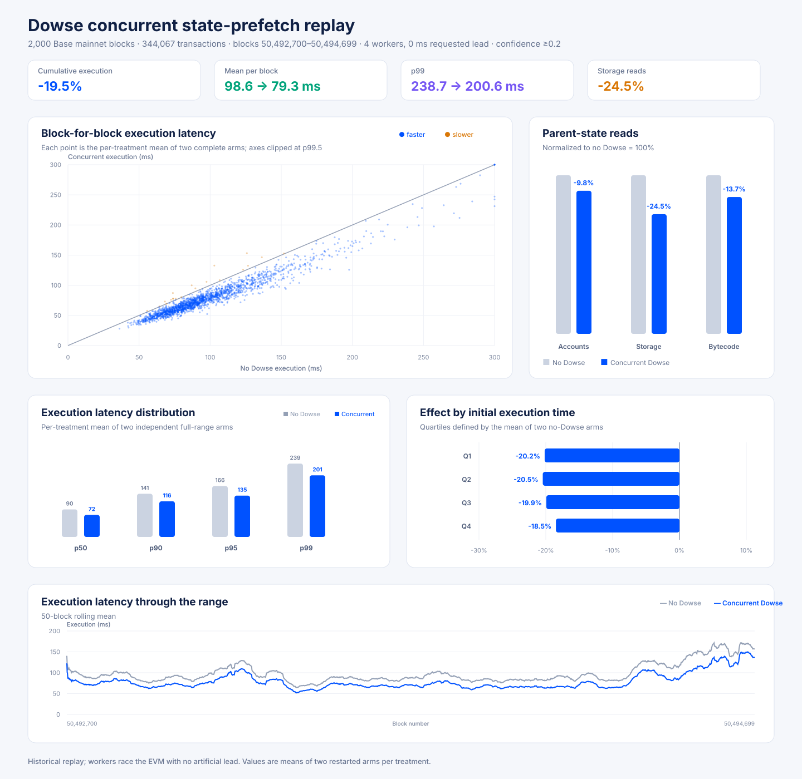
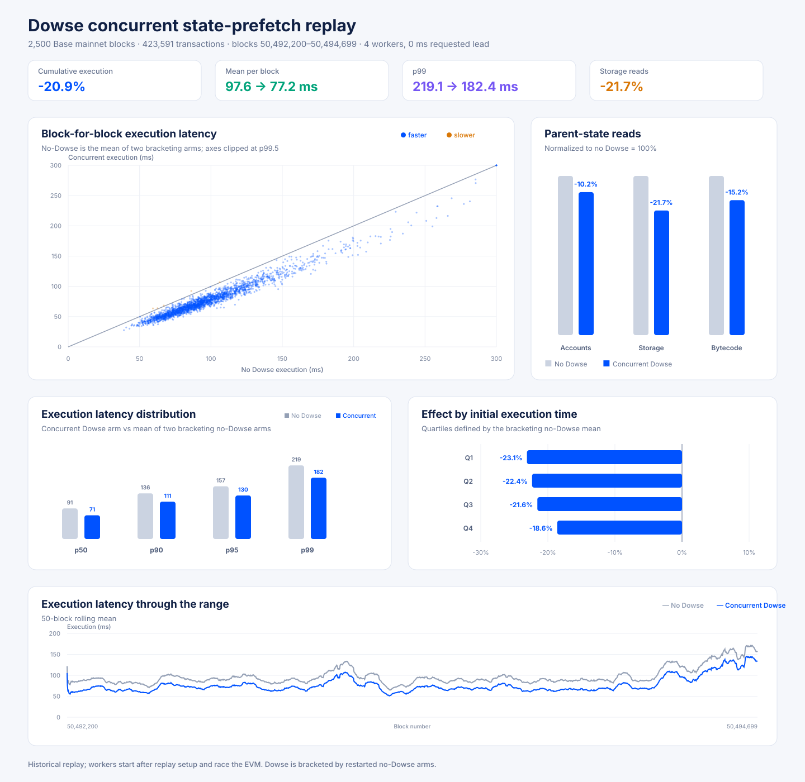
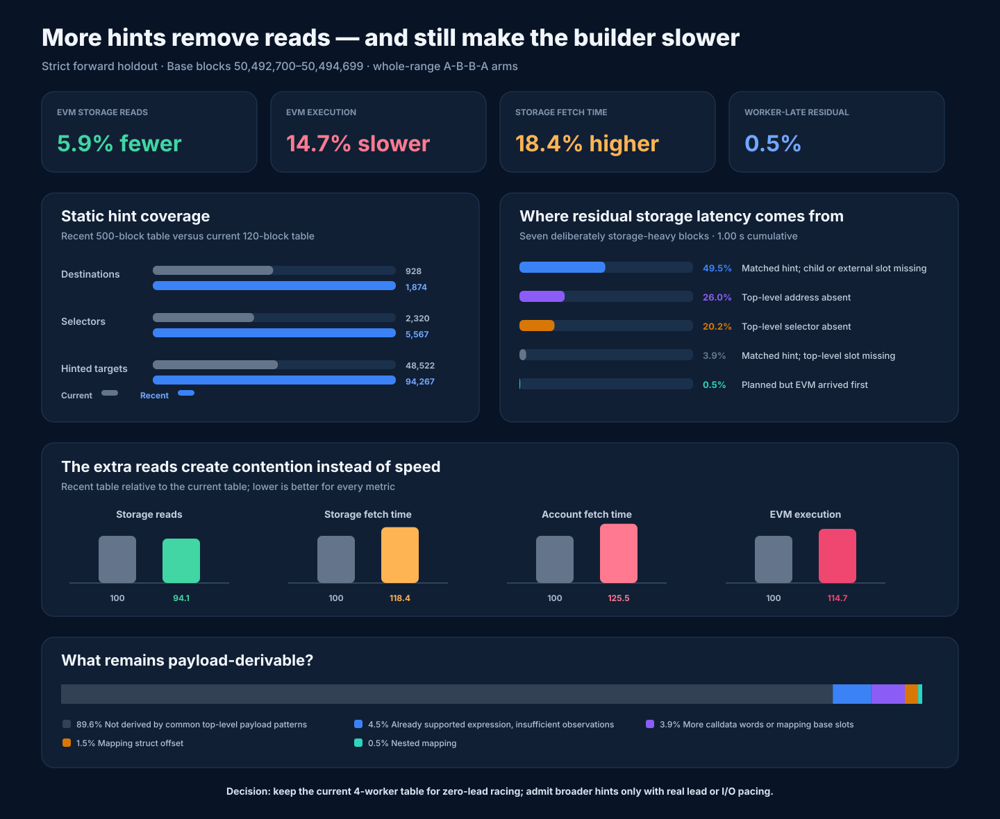
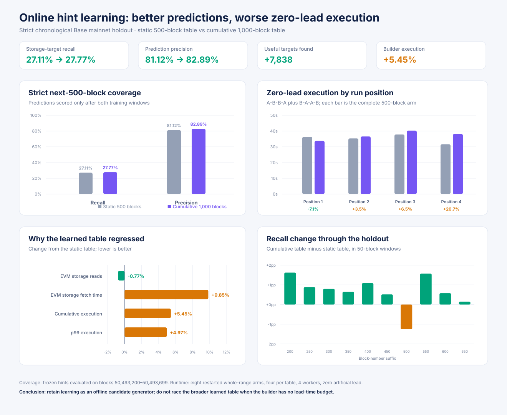
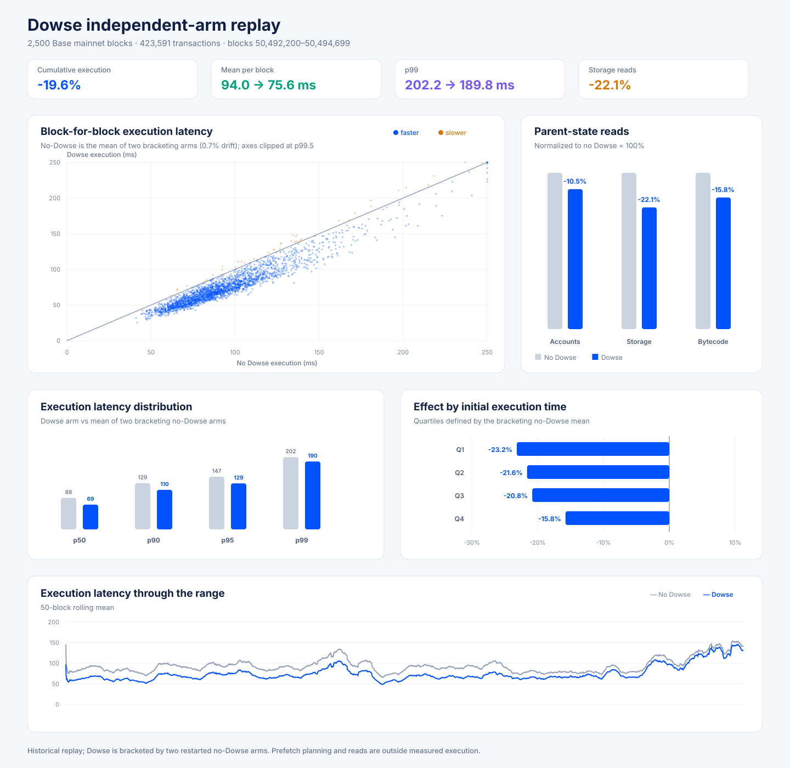

# Dowse state-prefetch benchmarks



## Priority-scheduled concurrent replay over 2,000 blocks

The final implementation replaces the earlier per-worker transaction FIFOs with one central queue
of concrete account, storage, and bytecode targets. The Flashblocks builder and all four persistent
workers share one exact-parent `ExecutionCache`; each worker owns its own state provider. The
scheduler:

- promotes the transaction currently selected by the builder, then orders work by transaction
  rank and hint confidence;
- restricts speculative work to four transactions beyond the builder cursor and rejects hints below
  20% confidence;
- deduplicates targets globally across transactions and checks the shared cache before every read;
- limits each transaction to 32 accounts and 256 storage slots; and
- invalidates stale targets as transactions are completed, parked, or rejected.

The production listener plans incrementally when the transaction pool changes, with a 25 ms timer
only as a fallback. The central target queue holds at most 65,536 entries. The selected defaults are
four workers, transaction distance four, locality batch one, and 32-account/256-slot limits.

### Final fixed-range comparison

The strict forward holdout is Base mainnet blocks 50,492,700–50,494,699: 2,000 blocks, 344,067
transactions, and 66.66 billion gas. It includes two blocks above 200 Mgas. The static hint table was
trained only on the preceding blocks 50,492,200–50,492,699, loaded once at process startup, and not
updated during replay.

A neutral no-Dowse arm first populated the host page cache. The measured sequence was no Dowse,
Dowse, no Dowse, Dowse, with a Base process restart before every complete arm. Each arm replayed the
entire range without alternating treatments within a block. The result below is each block's mean
across its two arms for each treatment.

Workers had no artificial lead: they were released immediately before EVM construction and raced
execution. The actual requested-zero lead was 3.20 µs on average and 61 µs at maximum. Every replay
verified the canonical block hash, full transaction order, and gas used.

| Measurement | Result |
| --- | ---: |
| Aggregate execution effect | **19.54% faster** |
| Paired-block bootstrap 95% sampling interval | **19.19–19.89% faster** |
| First raw/Dowse pair | 19.91% faster |
| Second raw/Dowse pair | 19.20% faster |
| Raw arm drift / Dowse arm drift | 10.93% / 11.90% |
| Mean execution per block | 98.6 ms without Dowse; 79.3 ms with Dowse |
| Cumulative measured execution | 197.2 s without Dowse; 158.7 s with Dowse |
| Parent-state storage reads / fetch time | 24.54% fewer / 35.62% lower |
| Parent-state account reads / fetch time | 9.78% fewer / 3.19% higher |
| Parent-state bytecode reads / fetch time | 13.70% fewer / 9.59% lower |
| Blocks faster by their two-arm treatment mean | 1,980 / 2,000 (99.0%) |

Absolute execution time drifted materially as the host became slower, but the contemporaneous
raw/Dowse effect changed by only 0.70 percentage points. Averaging two complete arms per treatment
reduces that arm-order bias. The narrow bootstrap interval captures block-sampling variation only;
the paired-arm spread is the more useful bound on host-wide drift.

| Percentile | Mean of no-Dowse arms | Mean of Dowse arms | Observed change |
| --- | ---: | ---: | ---: |
| p50 | 89.6 ms | 71.8 ms | 19.92% lower |
| p90 | 140.5 ms | 116.0 ms | 17.45% lower |
| p95 | 165.8 ms | 134.5 ms | 18.87% lower |
| p99 | 238.7 ms | 200.6 ms | 15.99% lower |

The benefit persists across the initial execution-time distribution rather than improving only
fast blocks:

| No-Dowse execution quartile | Range | Aggregate effect |
| --- | ---: | ---: |
| Fastest 25% | 36.2–74.8 ms | 20.17% faster |
| 25–50% | 74.9–89.6 ms | 20.46% faster |
| 50–75% | 89.6–112.0 ms | 19.92% faster |
| Slowest 25% | 112.0–490.8 ms | 18.49% faster |

| Block gas used | Blocks | Aggregate effect |
| --- | ---: | ---: |
| <25 Mgas | 586 | 21.63% faster |
| 25–50 Mgas | 1,225 | 19.92% faster |
| 50–100 Mgas | 172 | 16.18% faster |
| 100–200 Mgas | 15 | 13.11% faster |
| >200 Mgas | 2 | 13.10% faster |

| Block | Gas used | No Dowse | Dowse | Observed effect |
| --- | ---: | ---: | ---: | ---: |
| 50,493,188 | 208.5 Mgas | 454.8 ms | 366.7 ms | 19.38% faster |
| 50,494,654 | 259.3 Mgas | 490.8 ms | 455.1 ms | 7.28% faster |

### Scheduler behavior and remaining contention

Each Dowse arm planned the same 218,736 transactions, 131,696 account targets, and 1,708,195 storage
targets. No worker read completed before EVM execution began. On average, workers completed 131,675
account reads, 1,706,658 storage reads, and 109,157 bytecode reads while execution was active. Only
one storage read across both arms completed after execution, 33 became stale before reading, and no
read failed. The rest of the queued tail was abandoned when its block finished.

The EVM performed 24.54% fewer parent-state storage reads, while storage fetch time fell further,
by 35.62%. Account fetch time instead rose 3.19% despite 9.78% fewer account reads. Four workers can
therefore stay ahead of the single-threaded EVM, but they still contend with it and additional
workers are not free.

Historical replay knows the complete canonical transaction list before workers are released. Hint
planning took 13.69 ms per block on average and is intentionally excluded from the measured EVM
interval. Production avoids that serial cost by planning each private transaction on arrival. This
experiment establishes that the workers can race effectively with zero lead once targets exist; it
does not establish private-orderflow lead time, final ordering accuracy, or end-to-end sequencer
latency.

### MDBX read locality

Latest hashed accounts are keyed by `keccak(address)`. Hashed storage is a dupsort table grouped by
hashed address and then hashed slot; bytecode is keyed by code hash. However,
`StateProvider::storage` performs an individual `seek_by_key_subkey`, and the provider API used here
does not expose a reusable bulk cursor. Historical state replay can also traverse history and
changeset indexes, so sorting only latest-state hashed keys is not a faithful physical-I/O model.

A repeated 271-block screen compared locality batches of one and sixteen with otherwise identical
settings. Batch sixteen was about 2.4% slower, so the production default remains one: transaction
priority beats speculative key grouping. A future DB-specific bulk API with cursor reuse could
justify retesting locality, but merely reordering independent provider calls does not.

### Production interpretation

The central scheduler addresses the original correctness and efficiency concerns: workers write to
the exact cache consumed by the builder, duplicate reads are globally suppressed, and work follows
the builder's actual cursor rather than scanning distant transactions first. Confidence is a
secondary priority within transaction order, preventing a high-confidence distant target from
starving an imminent transaction.

The production sequencer trial still needs to measure private transaction arrival lead, target
queue age and drops, transaction replacement, completion before first EVM access, shared-cache hit
rate, provider contention, and end-to-end Flashblock build latency. It must also compare neither,
Dowse only, Reth txpool pre-sim only, and both. The current node's Reth txpool pre-sim remains
disabled; incoming-canonical-block pre-sim on the follower is not shared with this payload builder.

The artifacts are preserved under
`/home/brian/work/base-dowse-runtime/artifacts/dowse-scheduler-full-20260827`:

| Artifact | SHA-256 |
| --- | --- |
| `raw-before.jsonl` | `ebc4b748627f7f0129b5f4024970e93ffd63539588fea31b6076fe6fbadff6d4` |
| `tuned.jsonl` | `e5068e66e1c31c45f8bf6470f475b5a5529756f59dd1f2ddee8b1d88582a1b63` |
| `raw-after.jsonl` | `316323b39ac2632a2784684b93972104eaf78a49b6ef44c02c90b4ef94651eb6` |
| `tuned-after.jsonl` | `de7cf4c3260b1ebde59c3eaddfda992d18f9ed77196385ba5fe04b0a4c1c92b9` |
| `warmup-raw.jsonl` | `05a115002f344f54a82bea2845423769d96431f5136f746f9d0894680e0244b6` |

The fixed hint table has SHA-256
`b573e98de710fc473adc3fa84253434df757eb163a75fa85c4c40d61b6049d7d`.

Restart Base before each measured arm, then render the two-arm treatment means:

```sh
python3 docs/benchmarks/dowse/run_concurrent_replay_arm.py \
  --start-block 50492700 --end-block 50494699 --variant raw --output raw-before.jsonl
python3 docs/benchmarks/dowse/run_concurrent_replay_arm.py \
  --start-block 50492700 --end-block 50494699 --variant concurrent --workers 4 \
  --head-start-us 0 --max-accounts-per-transaction 32 \
  --max-storage-slots-per-transaction 256 --max-transaction-distance 4 \
  --locality-batch-size 1 --min-confidence-bps 2000 --output tuned.jsonl
python3 docs/benchmarks/dowse/run_concurrent_replay_arm.py \
  --start-block 50492700 --end-block 50494699 --variant raw --output raw-after.jsonl
python3 docs/benchmarks/dowse/run_concurrent_replay_arm.py \
  --start-block 50492700 --end-block 50494699 --variant concurrent --workers 4 \
  --head-start-us 0 --max-accounts-per-transaction 32 \
  --max-storage-slots-per-transaction 256 --max-transaction-distance 4 \
  --locality-batch-size 1 --min-confidence-bps 2000 --output tuned-after.jsonl

python3 docs/benchmarks/dowse/render_independent_replay_chart.py \
  raw-before.jsonl tuned.jsonl chart.svg raw-after.jsonl tuned-after.jsonl
```



## Earlier per-worker-FIFO concurrent replay over 2,500 blocks

This section records the superseded worker design. Each worker consumed its own transaction FIFO;
it did not have the final scheduler's global target deduplication, builder-cursor priority, or
confidence ordering. Use the 2,000-block result above for the current implementation.

The production-shaped historical experiment replays Base mainnet blocks 50,492,200–50,494,699
with four direct-state-read workers and no artificial head start. Unlike the completed-cache
benchmark below, workers do not finish before execution starts. They are released after historical
signer recovery and parent-state setup, immediately before the EVM is constructed, and stop when
block execution ends. Opening each worker's state provider and every hinted read therefore race the
EVM cursor. Requested zero lead measured 3.25 µs on average and 15 µs at maximum.

The fixed range contains 2,500 blocks, 423,591 transactions, 81.5 billion gas, and two blocks above
200 Mgas. A neutral raw replay populated the host page cache. The measured arms then ran separately,
with a Base process restart before each complete arm, in this order:

1. no Dowse;
2. concurrent Dowse with 4 workers, 0 ms requested lead, and 32-account/256-slot per-transaction
   limits; and
3. a bracketing no-Dowse control.

Every replay verified the canonical block hash, complete transaction ordering, and summed gas. No
treatment alternation occurred inside an arm. The no-Dowse baseline is each block's mean across the
two controls.

| Measurement | Result |
| --- | ---: |
| Bracketed aggregate execution effect | **20.9% faster** |
| Paired-bootstrap 95% sampling interval | **20.7–21.2% faster** |
| No-Dowse control drift | 2.3% |
| Mean execution per block | 97.6 ms without Dowse; 77.2 ms with concurrent Dowse |
| Cumulative measured execution | 243.9 s without Dowse; 192.9 s with concurrent Dowse |
| Parent-state storage reads | 21.7% fewer |
| Parent-state account reads | 10.2% fewer |
| Parent-state bytecode reads | 15.2% fewer |
| Blocks faster than their bracketing baseline | 2,495 / 2,500 (99.8%) |
| Blocks regressing by more than 10 ms | 0 / 2,500 |

The bootstrap interval captures block-sampling variation only. The 2.3% control drift is the more
important bound on arm-wide host variation.

Do not interpret the 20.9% ratio as concurrent execution beating the earlier 19.6% completed-cache
result. Concurrent execution was slower in absolute terms (77.2 ms versus 75.6 ms), while this
run's no-Dowse baseline was also slower (97.6 ms versus 94.0 ms). The separately bracketed runs had
different host conditions and their relative percentages are not directly rankable.

### Latency distribution and slow blocks

| Percentile | Bracketed no Dowse | Concurrent Dowse | Observed change |
| --- | ---: | ---: | ---: |
| p50 | 91.1 ms | 70.6 ms | 22.5% lower |
| p90 | 135.9 ms | 111.2 ms | 18.2% lower |
| p95 | 156.9 ms | 129.5 ms | 17.4% lower |
| p99 | 219.1 ms | 182.4 ms | 16.8% lower |

The benefit remains substantial as initial execution time increases:

| No-Dowse execution quartile | Range | Aggregate effect |
| --- | ---: | ---: |
| Fastest 25% | 39.0–75.9 ms | 23.1% faster |
| 25–50% | 75.9–91.1 ms | 22.4% faster |
| 50–75% | 91.1–109.6 ms | 21.6% faster |
| Slowest 25% | 109.7–487.7 ms | 18.6% faster |

| Block gas used | Blocks | Aggregate effect |
| --- | ---: | ---: |
| <25 Mgas | 753 | 23.5% faster |
| 25–50 Mgas | 1,542 | 21.2% faster |
| 50–100 Mgas | 188 | 16.5% faster |
| 100–200 Mgas | 15 | 13.4% faster |
| >200 Mgas | 2 | 15.2% faster |

| Block | Gas used | No Dowse | Concurrent Dowse | Observed effect |
| --- | ---: | ---: | ---: | ---: |
| 50,493,188 | 208.5 Mgas | 421.2 ms | 349.1 ms | 17.1% faster |
| 50,494,654 | 259.3 Mgas | 487.7 ms | 421.4 ms | 13.6% faster |

### Worker timing and contention

The hint planner emitted unique work for 211,916 transactions: 161,618 account targets and
2,138,551 storage targets. Workers completed all but 50 concrete targets before the EVM returned.
One of those reads completed just after execution and was not inserted, leaving 49 unattempted.
Zero reads were classified as completing before execution, so the observed result comes from
workers staying ahead of the main EVM cursor rather than from a completed cache.

Storage fetch time on the EVM thread fell 35.1%, more than the 21.7% reduction in fetch count.
Account fetch time increased 10.1% despite 10.2% fewer account fetches, evidence that concurrent
workers do create provider contention. This is why increasing worker count is not free.

The planner took 4.9 ms per block on average, but historical replay plans the complete canonical
block before releasing workers. That planning interval is not included in measured EVM execution.
In production, planning must happen incrementally as private transactions arrive and must remain off
the payload critical path.

### Parameter search

A deterministic 26-block screen covered four gas cohorts and both blocks above 200 Mgas. A
stratified 122-block validation then compared the survivors against interleaved raw controls:

| Workers | Requested lead | Reads complete before EVM | Storage-read change | Execution change | Change if lead is charged |
| ---: | ---: | ---: | ---: | ---: | ---: |
| 2 | 0 ms | 0.0% | 21.1% fewer | 14.9% faster | 14.9% faster |
| **4** | **0 ms** | **0.0%** | **21.3% fewer** | **16.2% faster** | **16.2% faster** |
| 4 | 2 ms | 18.0% | 21.7% fewer | 15.2% faster | 13.3% faster |
| 4 | 5 ms | 51.2% | 21.8% fewer | 16.4% faster | 11.7% faster |

Eight and sixteen workers removed approximately the same number of EVM reads but performed worse
because of I/O contention. A 10 ms lead let 84.7% of reads finish early in the short screen but did
not improve execution beyond 5 ms. The selected configuration is therefore four workers with no
intentional delay. Any real lead from private-orderflow arrival is upside; payload construction
should not wait for Dowse.

The limit screen found that 8 accounts/64 slots lost material coverage, 16/128 nearly matched the
default, and increasing 32/256 to 64/512 removed only another 0.3% of storage reads. The selected
configuration therefore retains the production defaults of four workers and 32/256 limits. It does
not tune the 25 ms txpool polling interval or the 64-plan queue per worker: canonical replay knows
the final transaction list and cannot reproduce private transaction arrival, replacement, or final
sequencer ordering. Those scheduler settings need real sequencer telemetry. Event-driven planning
would be preferable to intentionally delaying payload construction.

### Hint coverage and provider contention



The initial zero-lead run above used a static table built from 120 historical blocks: 928 top-level
destinations, 2,320 selectors, and 48,522 hinted targets in a 13 MiB file. The table is loaded once
at process startup and is not updated online. Every target is trace-inferred storage; the current
generator supplies neither bytecode-derived account/call-chain hints nor implementation sharing by
actual bytecode hash. Most targets are historical concrete slots; only about 950 expression nodes
depend on the caller or calldata.

Coverage is useful but not sufficient. On seven deliberately storage-heavy blocks, only 0.5% of
the residual storage-fetch latency was work that a worker planned but did not finish before the EVM.
The other 99.5% was never planned:

| Residual class | Share of residual storage-fetch latency |
| --- | ---: |
| Matched top-level hint, but child/external slot missing | 49.5% |
| Top-level destination absent | 26.0% |
| Top-level selector absent | 20.2% |
| Matched hint, but top-level slot missing | 3.9% |
| Planned, but EVM arrived first | 0.5% |

The seven blocks were 50,493,188; 50,493,795; 50,494,399; 50,494,532; 50,494,575;
50,494,654; and 50,494,656. Their largest residual storage-latency contracts included USDC
(`0x833589…2913`, 59.8 ms), Uniswap v4 PoolManager (`0x498581…2b2b`, 39.7 ms), WETH
(`0x420000…0006`, 37.0 ms), Aerodrome Slipstream position NFT (`0xe1f8cd…8b53`, 31.8 ms),
Aerodrome CL position manager (`0x827922…5b72`, 29.3 ms), cbBTC (`0xcbb7c0…33bf`, 28.2 ms),
and Aerodrome Voter (`0x166135…80a5`, 20.6 ms). These are cumulative times across the selected
blocks, not single-fetch latencies.

Across the full 2,500-block current-table run, the worst remaining EVM-thread storage-fetch totals
were block 50,494,654 at 190.8 ms, 50,494,532 at 167.9 ms, 50,493,188 at 162.2 ms,
50,494,655 at 161.5 ms, and 50,494,574 at 159.9 ms. I/O therefore still materially affects the
tail even with the winning configuration.

To test broader dowsing rather than infer its effect, a second table was trained on the strictly
earlier 500-block range 50,492,200–50,492,699. A 40% fixed-slot frequency threshold produced a
25 MiB table with 1,874 destinations, 5,567 selectors, and 94,267 targets. On the later seven-block
holdout, storage-target recall rose from 13.9% to 17.8%, precision rose from 66.9% to 74.2%, and
predictions rose from 11,206 to 12,910.

That planner improvement did not translate into builder performance with the earlier per-worker
FIFO. A strict forward replay of blocks 50,492,700–50,494,699 ran whole-range A-B-B-A arms in the
order current table, recent table, recent table, current table, with a process restart before every
arm. Against the current table, the recent table produced:

| Measurement | Recent table versus current table |
| --- | ---: |
| EVM storage fetches | 5.86% fewer |
| EVM storage fetch time | 18.36% higher |
| EVM account fetches | 1.79% fewer |
| EVM account fetch time | 25.47% higher |
| EVM execution | **14.67% slower** |
| Paired-bootstrap 95% sampling interval | 14.15–15.20% slower |
| Blocks faster | 123 / 2,000 |
| p50 / p99 execution | 17.2% / 6.75% slower |

The broad table issued 7.8% more storage targets and occupied the state provider for longer while
the EVM was running. Reducing its worker count from four to one recovered 4.6% on the short screen
while allowing only 1.2% more EVM storage fetches, but still did not make the broad table competitive
with the current four-worker table. More accurate predictions can therefore regress zero-lead
execution when their reads increase provider contention.

The residual gaps are partly methodological and partly fundamental. Of the unplanned storage
accesses, 4.5% use expression forms Dowse already supports but lacked enough observations; another
5.9% need more calldata words/base slots, mapping-struct offsets, or nested mappings. Those are
direct generator improvements. A further 89.6% did not match the common top-level-payload formulas
tested. That category is not all permanently unknowable: 48.7% of missed accesses targeted an exact
address/slot pair seen in at least two selected blocks and could feed a bounded, decaying hot-target
learner.
However, a first-seen slot derived from internal calldata, an internal caller, or an earlier state
read is fundamentally unavailable to a strict top-level-payload planner. Covering it requires
protocol-aware router decoding, recursive hints with known internal context, or bounded pre-sim.

These findings motivated the central priority scheduler in the final validation above: preserve
confidence, rank work by transaction distance from the builder cursor, deduplicate globally, and
stop low-return work before it creates provider contention. Broader or online-learned targets still
need measurable private-orderflow lead or an explicit I/O budget. Online targets must also be
bounded and decayed to prevent adversarial cache pollution.

The coverage artifacts are under
`/home/brian/work/base-dowse-runtime/artifacts/dowse-coverage-selected-20260827`, and the full
A-B-B-A artifacts are under
`/home/brian/work/base-dowse-runtime/artifacts/dowse-hint-full-abba-20260827`. The current and recent
table SHA-256 values are respectively
`888c58bb18035e9797610efb9d92dee17b9959c11a661926043a48c32efa01ec` and
`0f1453b27f117627bec2b6103018ef75635b4c94ea3f6d6a310528cba00dc175`.

## Chronological online learning



Dowse now has an incremental trace learner that retains inference counters instead of full calldata
and trace payloads. Feeding it 1,000 blocks required 2.10 seconds of CPU for 164,905 transaction
observations, including a 65.9 ms final snapshot, and peaked at 187 MiB RSS. This implementation is
cumulative and deliberately not connected to the builder: production use would first require decay
and cardinality bounds.

The first forward-only experiment trained on blocks 50,492,200–50,492,699 and updated only from
transactions in the later 50,492,700–50,493,199 range. Refreshing a cumulative table every ten
blocks raised recall from 27.38% to 28.38% on that first holdout. A stricter test then froze both
tables and evaluated the unseen next 500 blocks, 50,493,200–50,493,699:

| Strict holdout measurement | Static 500-block table | Cumulative 1,000-block table |
| --- | ---: | ---: |
| Storage-target recall | 27.11% | **27.77%** |
| Prediction precision | 81.12% | **82.89%** |
| Useful targets found | 322,745 | **330,583** |
| Total predictions | 397,858 | 398,817 |
| False predictions | 75,113 | **68,234** |

The cleaner table nevertheless regressed zero-lead execution. Two restarted whole-range sequences,
A-B-B-A and B-A-A-B, provided four 500-block arms for each table while balancing treatment position.
Both variants used the production scheduler settings: four workers, transaction distance four,
locality batch one, 2,000-basis-point minimum confidence, and 32-account/256-slot limits.

| Runtime measurement | Cumulative table versus static table |
| --- | ---: |
| EVM storage fetches | 0.77% fewer |
| EVM storage fetch time | **9.85% higher** |
| Cumulative EVM execution | **5.45% slower** |
| p50 / p90 / p99 execution | 5.10% / 4.74% / 4.97% slower |
| p95 execution | 0.39% faster |
| Blocks faster by their four-arm mean | 71 / 500 |

The additional table issued 1,575 more unique storage targets and 1,301 more account targets over
the range. It removed about 6,780 EVM storage reads per arm, but the extra concurrent provider work
cost much more than those avoided reads saved. Online learning is therefore retained as a fast
offline candidate generator, not a production builder feature. Broader learned hints should be
admitted only when private orderflow supplies measurable lead time or under a stricter I/O budget.
The coverage and runtime summaries are under
`/home/brian/work/base-dowse-runtime/artifacts/dowse-online-learning-20260827`.

## Follower txpool is not a sequencer-orderflow proxy

A ten-minute live sample explained the surprising nonempty follower txpool. Its pending count moved
between zero and 24, with 111 unique transactions from 30 senders. Of those hashes, 87 (78.4%)
appeared in the 217 canonical blocks sequenced during the observation window; this is a lower bound
because 15 transactions first appeared in the final sample. Traffic was highly concentrated: 83
transactions targeted one contract and another 21 targeted a second contract. The median gas limit
was 8 million and 110 of 111 transfers had zero value, consistent with automated contract traffic.

The node has ordinary execution-layer P2P transaction gossip enabled and two peers. Base's private
sequencer mempool does not prevent users from also gossiping transactions publicly, so these were
mostly genuine public transactions that also reached the sequencer. This pool can test mechanics,
but its sparse and concentrated orderflow cannot establish production hit rate, ordering, or lead
time for the private block builder.

## Earlier concurrent-replay interpretation

This experiment removes the earlier infinite-prefetch assumption and demonstrates that bounded
direct reads can race a single-threaded EVM successfully with zero artificial lead. It still knows
the complete canonical transaction list and order before execution. It therefore establishes the
I/O mechanism and worker count, not production hit rate from private orderflow. A sequencer trial
must measure transaction arrival lead, queue age and drops, completion before first EVM access,
exact-parent cache hits, provider contention, and Flashblock build latency.

Reth's incoming-canonical-block pre-sim remains active on the follower, but its cache is not shared
with the payload builder. Reth's separate txpool pre-sim (`--engine.txpool-prewarming`) remains
disabled. A sequencer rollout should compare neither, Dowse only, Reth txpool pre-sim only, and both
because the mechanisms are additive semantically but compete for CPU and I/O.

The corrected artifacts are preserved on the benchmark host under
`/home/brian/work/base-dowse-runtime/artifacts/dowse-concurrent-final-20260827`:

| Artifact | SHA-256 |
| --- | --- |
| `raw.jsonl` | `ca96d87ac117a10c07c28194c76225c5d311497c38bd8b104b7d312e4b071234` |
| `tuned-w4-h0-a32-s256.jsonl` | `32b9651e1950ee7f5c54b685aa8c0e0fd5407aeb49ae3f68edc4566f621dc74d` |
| `raw-bracket.jsonl` | `fb48eaa5f67d074aa0e0c856c82d47158737e2ad10ca37e1c3dd81471445e956` |
| `warmup-raw.jsonl` | `8bcc5ea307cf157178076c42ae2f17fa30595c528af4f9c4756f24885f4f8ea6` |

The fixed hint table has SHA-256
`888c58bb18035e9797610efb9d92dee17b9959c11a661926043a48c32efa01ec` and is loaded once at process
startup; this benchmark performs no online learning.

Run a neutral raw arm and restart the Base process before each measured command:

```sh
python3 docs/benchmarks/dowse/run_concurrent_replay_arm.py \
  --start-block 50492200 --end-block 50494699 --variant raw --output warmup-raw.jsonl

# Restart before raw, concurrent, and raw-bracket respectively.
python3 docs/benchmarks/dowse/run_concurrent_replay_arm.py \
  --start-block 50492200 --end-block 50494699 --variant raw --output raw.jsonl
python3 docs/benchmarks/dowse/run_concurrent_replay_arm.py \
  --start-block 50492200 --end-block 50494699 --variant concurrent --workers 4 \
  --head-start-us 0 --max-accounts-per-transaction 32 \
  --max-storage-slots-per-transaction 256 --output tuned.jsonl
python3 docs/benchmarks/dowse/run_concurrent_replay_arm.py \
  --start-block 50492200 --end-block 50494699 --variant raw --output raw-bracket.jsonl

python3 docs/benchmarks/dowse/render_independent_replay_chart.py \
  raw.jsonl tuned.jsonl chart.svg raw-bracket.jsonl
```

## Completed-cache upper-bound replay



This benchmark replayed Base mainnet blocks 50,492,200–50,494,699: 2,500 fixed contiguous blocks,
423,591 transactions, and 81.5 billion gas. The range includes two blocks above 200 Mgas. A fixed
static Dowse hint table was loaded once at process startup and was not updated during any arm.

The node first ran an unmeasured no-Dowse pass to populate the host page cache. It then restarted
the Base process before each complete measured arm in this order:

1. no Dowse;
2. Dowse; and
3. a bracketing no-Dowse control.

No treatment alternation occurred within an arm. The no-Dowse baseline below is the per-block mean
of its two bracketing arms. Their cumulative times differed by only 0.7%, which bounds the observed
arm-order drift. Every replay verified the canonical block hash, full transaction sequence, and sum
of transaction gas against the canonical header. The range was kept entirely beyond the node's
moving state-history boundary; an earlier attempt that crossed that boundary was rejected after its
gas validation failed.

| Measurement | Result |
| --- | ---: |
| Bracketed aggregate execution effect | **19.6% faster** |
| Paired-bootstrap 95% sampling interval | **19.2–20.0% faster** |
| No-Dowse control drift | 0.7% |
| Mean execution per block | 94.0 ms without Dowse; 75.6 ms with Dowse |
| Cumulative measured execution | 235.1 s without Dowse; 189.1 s with Dowse |
| Parent-state storage reads | 22.1% fewer |
| Parent-state account reads | 10.5% fewer |
| Parent-state bytecode reads | 15.8% fewer |
| Transactions producing a hint plan | 266,664 / 423,591 (63.0%) |
| Hint planning | 4.9 ms mean per block |
| Four-worker state prefetch | 10.1 ms mean per block |

The bootstrap interval captures block-sampling variation, not an arm-wide host effect. The two
no-Dowse controls are the relevant check on that systematic risk. Planning and state reads are
outside the measured execution interval: this measures the value of a completed parent-state cache,
not serial end-to-end latency.

### Latency distribution

| Percentile | Bracketed no Dowse | Dowse | Observed change |
| --- | ---: | ---: | ---: |
| p50 | 88.1 ms | 69.2 ms | 21.5% lower |
| p90 | 129.3 ms | 110.5 ms | 14.5% lower |
| p95 | 147.2 ms | 128.6 ms | 12.7% lower |
| p99 | 202.2 ms | 189.8 ms | 6.1% lower |

Unlike the superseded paired run, this sample shows a benefit through p99. The relative gain still
decreases as blocks become slower:

| No-Dowse execution quartile | Range | Aggregate effect |
| --- | ---: | ---: |
| Fastest 25% | 41.1–73.9 ms | 23.2% faster |
| 25–50% | 73.9–88.1 ms | 21.6% faster |
| 50–75% | 88.2–106.3 ms | 20.8% faster |
| Slowest 25% | 106.3–467.4 ms | 15.8% faster |

### Effect by block gas

| Block gas used | Blocks | Aggregate effect |
| --- | ---: | ---: |
| <25 Mgas | 753 | 24.2% faster |
| 25–50 Mgas | 1,542 | 19.9% faster |
| 50–100 Mgas | 188 | 12.0% faster |
| 100–200 Mgas | 15 | 5.2% faster |
| >200 Mgas | 2 | 11.9% faster |

| Block | Gas used | No Dowse | Dowse | Observed effect |
| --- | ---: | ---: | ---: | ---: |
| 50,493,188 | 208.5 Mgas | 429.6 ms | 357.6 ms | 16.8% faster |
| 50,494,654 | 259.3 Mgas | 467.4 ms | 432.5 ms | 7.5% faster |

Two blocks are enough to show that the cache can help very large blocks, not to estimate the
above-200 Mgas population precisely.

### Interpretation

This is an idealized historical cache-effect measurement. It knows the complete canonical
transaction list and order, and it allows all four workers to finish before timing execution. It
does not establish that background workers can finish from real private-sequencer orderflow before
payload execution begins. The production experiment must measure hint lead time, queue age,
completion before first access, cache hits, and payload latency.

Same-transaction serial Dowse is no longer a candidate: the earlier replay measured planning,
state reads, and cached execution together as 1.8% slower than raw execution. Production Dowse must
remain a persistent background direct-read service.

### Interaction with Reth pre-sim

The follower's incoming-canonical-block pre-sim remains active. It starts only after a complete
block arrives, skips blocks with fewer than five transactions, and uses the process's available
parallelism. The current node does not enable
`--engine.share-execution-cache-with-payload-builder`, so that work does not supply the payload
builder's cache.

Reth's separate `--engine.txpool-prewarming` path is disabled on this node. Despite its historical
name, it is transaction pre-sim: one persistent worker sequentially EVM-executes the best pool
transactions in batches capped at 100 ms. It is not a tuned worker pool.

Dowse performs bounded non-EVM planning followed by direct parent-state reads. The current
Flashblocks experiment scans at 25 ms intervals and uses four persistent blocking workers, a queue
of 64 jobs per worker, at most 2,048 transactions per scan, limits of 32 accounts and 256 slots per
transaction, and a 256 MiB exact-parent cache. These are smoke-test settings, not tuned production
values. Dowse and Reth txpool pre-sim are semantically additive if both are enabled, but they compete
for CPU, I/O, and cache capacity. A sequencer experiment must therefore compare neither, Dowse only,
Reth txpool pre-sim only, and both.

Denim is not relevant to this measurement: the current production target is the Flashblocks
sequencer path. Wiring the later basic builder is follow-up work before that hardfork activates.

## Superseded paired replay

The earlier 50,493,300–50,495,799 benchmark executed both variants consecutively for every block and
alternated which variant ran first. The first replay averaged 1.44× the second because it populated
the exact pages consumed by the next replay. The resulting ±80% per-block spread and the reported
12.9% order-balanced estimate depend on an unverified correction for that artifact. Do not use that
run as performance evidence; `dowse-replay-2500-2026-08-26.svg` is retained only for provenance.

The initial 40-block pilot has the same paired-replay limitation and is also superseded.

## Terminology and reproduction

- **Prefetching**: non-EVM parent-state reads selected by Dowse hints.
- **Pre-sim**: speculative EVM execution. Dowse does not use pre-sim on the transaction critical
  path.

Run a neutral warmup, then restart the Base process before each measured command:

```sh
python3 docs/benchmarks/dowse/run_independent_replay_arm.py \
  --start-block 50492200 --end-block 50494699 --variant raw --output warmup.jsonl

# Restart Base, then run raw.jsonl. Restart again, then run dowse.jsonl. Restart once more for
# raw-bracket.jsonl.
python3 docs/benchmarks/dowse/run_independent_replay_arm.py \
  --start-block 50492200 --end-block 50494699 --variant raw --output raw.jsonl
python3 docs/benchmarks/dowse/run_independent_replay_arm.py \
  --start-block 50492200 --end-block 50494699 --variant dowse --output dowse.jsonl
python3 docs/benchmarks/dowse/run_independent_replay_arm.py \
  --start-block 50492200 --end-block 50494699 --variant raw --output raw-bracket.jsonl

python3 docs/benchmarks/dowse/render_independent_replay_chart.py \
  raw.jsonl dowse.jsonl chart.svg raw-bracket.jsonl
```

Do not benchmark a range crossing the live node's state-history retention boundary. The arm runner
aborts if replayed transaction hashes or gas differ from the canonical block.

The preserved artifacts are stored on the benchmark host under
`/home/brian/work/base-dowse-runtime/artifacts/dowse-independent-safe-20260827`:

| Artifact | SHA-256 |
| --- | --- |
| `raw.jsonl` | `c778adffe59b51b8c94e8205af73abf0cbbf012597bfcd001160c62df7760432` |
| `dowse.jsonl` | `ec6e419be7704d883b1f77db1a71a54c4fbe3a917a5cd83f7c250b298279d824` |
| `raw-bracket.jsonl` | `defc2faea1c03cf770b9a28e0d73381b7b65e08d00f289a04e4abfff20e3fd78` |
| `warmup-raw.jsonl` | `0eaa3b0813fc6ed1e827c1d0d5506848e97b00385535071b4c65daaee5f2e28a` |

The static hint table has SHA-256
`888c58bb18035e9797610efb9d92dee17b9959c11a661926043a48c32efa01ec`.

## Shadow-sequencer smoke test

A controlled mainnet-follower smoke test ran the Flashblocks builder with four persistent prefetch
workers, a 256 MiB exact-parent cache, and deterministic parent-hash A/B selection. It confirmed
that hint planning and parent-state reads run off the transaction execution path and that private
payloads are neither committed to the conductor nor gossiped. The run performed 2,382 successful
background reads for 271 planned pool transactions without worker-queue drops.

It did not produce a useful latency comparison: the follower saw only sparse public-gossip
transactions, not the sequencer's private orderflow. Shadow reconciliation also stalled because it
required a contiguous unsafe-gossip replacement range. A production-shaped A/B therefore needs
real sequencer orderflow or a reliable canonical fallback for shadow reconciliation.
