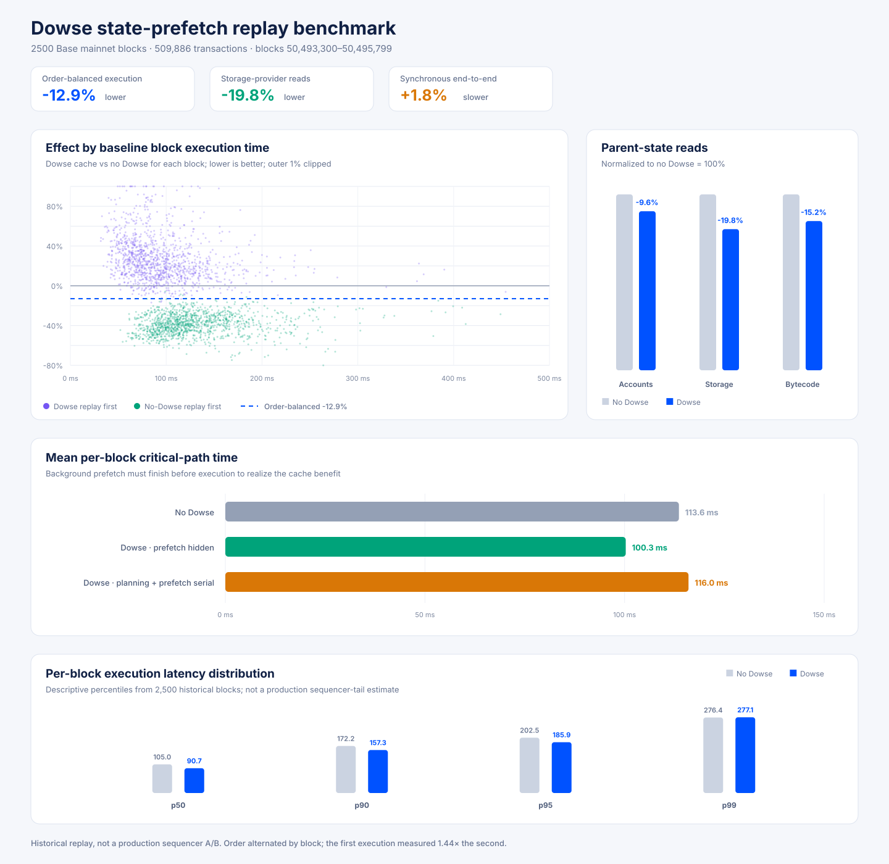
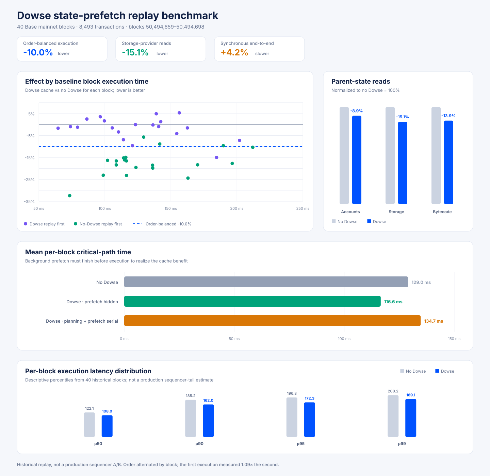

# Dowse state-prefetch benchmarks



## 2,500-block canonical replay

This benchmark replayed Base mainnet blocks 50,493,300–50,495,799: 2,500 contiguous blocks,
509,886 transactions, and 91.3 billion gas. It loaded a fixed static Dowse hint table at startup.
For each canonical block, the benchmark executed the same transactions and parent state with and
without the Dowse cache, verified identical transaction hashes and gas-used outcomes, and
alternated which treatment executed first (1,250 blocks each).

| Measurement | Result |
| --- | ---: |
| Order-balanced geometric-mean execution effect | **12.9% faster** |
| Stratified-bootstrap 95% confidence interval | **12.3–13.6% faster** |
| Time-weighted aggregate execution | 11.7% faster |
| Mean execution per block | 113.6 ms without Dowse; 100.3 ms with Dowse |
| Cumulative measured execution | 284.0 s without Dowse; 250.7 s with Dowse |
| Parent-state storage reads | 19.8% fewer |
| Parent-state account reads | 9.6% fewer |
| Parent-state bytecode reads | 15.2% fewer |
| Transactions producing a hint plan | 277,395 / 509,886 (54.4%) |
| Hint planning | 6.0 ms mean per block |
| Background state prefetch | 9.7 ms mean per block |
| Planning + prefetch + cached execution, if run serially | 1.8% slower |

The order-balanced estimate uses the geometric mean of per-block ratios within the two replay-order
strata. This is the appropriate headline for the observed multiplicative cold-cache effect: the
first execution measured 1.44× the second. It assumes that first-execution cost is independent of
which treatment runs first. The observed multipliers were 1.42× for no-Dowse-first and 1.46× for
Dowse-first; their difference was not statistically significant. This is still a historical replay,
not a production sequencer A/B.

### Latency distribution

These percentiles describe the balanced historical-replay distributions. They are not causal
quantile effects because each distribution mixes cold-first and warm-second executions.

| Percentile | No Dowse | Dowse | Observed change |
| --- | ---: | ---: | ---: |
| p50 | 105.0 ms | 90.7 ms | 13.6% lower |
| p90 | 172.2 ms | 157.3 ms | 8.6% lower |
| p95 | 202.5 ms | 185.9 ms | 8.2% lower |
| p99 | 276.4 ms | 277.1 ms | 0.3% higher |

The sample supports a p50–p95 improvement, but **does not establish a p99 change**. The observed
p99 difference was +0.7 ms and its stratified-bootstrap 95% interval was −36.2 to +25.9 ms. The
production shadow-sequencer A/B must measure tail latency directly over a longer period.

### Effect by execution size

Observed no-Dowse duration cannot safely define bins because replay order strongly affects it.
Instead, the execution-time proxy below is the geometric mean of each block's two measured
durations, which largely cancels a multiplicative first-execution effect.

| Execution-time proxy quartile | Range | Order-balanced effect |
| --- | ---: | ---: |
| Fastest 25% | 36.1–76.9 ms | 16.4% faster |
| 25–50% | 76.9–96.0 ms | 13.7% faster |
| 50–75% | 96.0–123.2 ms | 11.2% faster |
| Slowest 25% | 123.2–440.2 ms | 10.2% faster |

The relative benefit decreases for slower blocks, but remains about 10% in the slowest quartile.
The result is also positive in every gas-used cohort:

| Block gas used | Blocks | Order-balanced effect |
| --- | ---: | ---: |
| <25 Mgas | 582 | 16.4% faster |
| 25–50 Mgas | 1,567 | 12.1% faster |
| 50–100 Mgas | 318 | 10.3% faster |
| 100–200 Mgas | 31 | 6.6% faster |
| >200 Mgas | 2 | 10.7% faster |

The two >200 Mgas blocks were repeated in both execution orders:

| Block | Gas used | Dowse-first change | No-Dowse-first change | Order-balanced effect |
| --- | ---: | ---: | ---: | ---: |
| 50,494,654 | 259.3 Mgas | 6.1% faster | 4.4% faster | 5.3% faster |
| 50,495,185 | 200.6 Mgas | 5.8% faster | 15.0% faster | 10.5% faster |

With only two blocks, this is evidence that state prefetching still helps very large blocks—not a
precise estimate of the >200 Mgas population.

### Static-hint durability

The hint table was not updated during the 83-minute range. Its value did not collapse, though
coverage and storage-read savings varied over time:

| Range quarter | Planned transactions | Storage reads | Order-balanced effect |
| --- | ---: | ---: | ---: |
| First 625 blocks | 57.9% | 24.5% fewer | 14.9% faster |
| Second 625 blocks | 64.8% | 21.3% fewer | 13.2% faster |
| Third 625 blocks | 46.1% | 16.1% fewer | 11.2% faster |
| Final 625 blocks | 55.6% | 18.9% fewer | 12.5% faster |

Once shadow reconciliation has a reliable canonical fallback, the next production-shaped
measurement should keep the existing builder cache outermost, run background Dowse prefetch for
both variants, and allow only deterministic parent-hash-selected payloads to consult the Dowse
cache.

## Earlier 40-block pilot



The initial 40-block replay (8,493 transactions) produced a 10.0% order-balanced geometric-mean
execution improvement and 15.1% fewer storage-provider reads. Its first-execution effect was only
1.09×, but the sample was too small for useful tail conclusions; the 2,500-block run supersedes it.

## Terminology and reproduction

- **Prefetching**: non-EVM parent-state reads selected by Dowse hints.
- **Pre-sim**: speculative EVM execution. Dowse does not use pre-sim on the transaction critical
  path.

Run a compact benchmark without retaining the large per-transaction access traces returned by the
RPC:

```sh
python3 docs/benchmarks/dowse/run_replay_benchmark.py \
  --start-block 50493300 --end-block 50495799 --output benchmark.jsonl
```

Render a chart from either the compact or full JSONL artifact:

```sh
python3 docs/benchmarks/dowse/render_replay_chart.py benchmark.jsonl chart.svg
```

The preserved 2,500-block artifact has SHA-256
`1f3264dcfe450b6c3a07e2acd1e7144e0622a578570eee967781b1c4f31c4716` and is stored on the
benchmark host at
`/home/brian/work/base-dowse-runtime/artifacts/dowse-benchmark-20260826/dowse-benchmark-2500-thick.jsonl`.
The static hint table has SHA-256
`888c58bb18035e9797610efb9d92dee17b9959c11a661926043a48c32efa01ec`.

## Shadow-sequencer smoke test

A controlled mainnet-follower smoke test ran the production builder with four background prefetch
workers, a 256 MiB cache, and deterministic parent-hash A/B selection. It confirmed that the
builder starts, hint planning and parent-state reads run off the transaction execution path, and
the private payloads are neither committed to the conductor nor gossiped.

The test did **not** produce a useful latency comparison. The follower's public-gossip transaction
pool was too sparse: across the first 10 private payloads, only 15 non-system transactions were
included in measured simulation calls, none in a cache-enabled call. The run performed 2,382
successful background reads for 271 planned pool transactions without worker-queue drops.

After its first 10-block cycle (canonical anchor 50,497,426; private head 50,497,436), the shadow
sequencer waited indefinitely for a complete canonical replacement range. The reconciliation gate
requires every authenticated unsafe-gossip payload in the range, but gossip is not a reliable
contiguous transport. The configured Flashblocks websocket cannot fill such a gap: that extension
maintains pending-state and RPC views but does not forward completed payloads to the shadow gate.
The node was restored to its original follower binary and configuration and resumed canonical
ingestion.

Therefore the historical replay remains the performance result. A subsequent production-shaped
A/B needs either real sequencer orderflow or a shadow reconciliation path with a reliable canonical
fallback (for example, rebuilding missing blocks from safe-derived payload attributes). It should
not rely exclusively on contiguous unsafe gossip.
