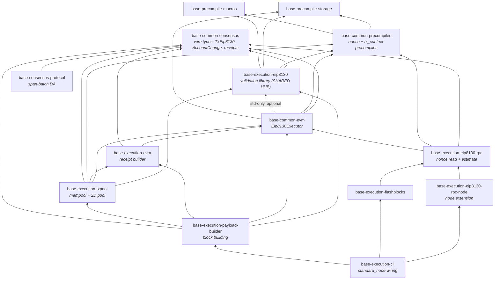
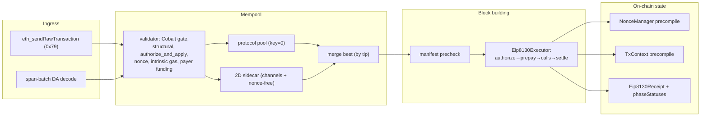

# EIP-8130 Audit Onboarding

> Companion doc for the audit kickoff. The first two sections
> ([The 5-minute model](#the-5-minute-model) and [Kickoff walkthrough](#kickoff-walkthrough))
> are meant to be read together on the call (~30 min). Everything after that is
> reference material to read on your own time — a crate map, an end-to-end
> lifecycle trace, a per-file index, and a risk-focused audit checklist.

EIP-8130 is **Account Abstraction by Account Configuration**: a new transaction
type (`0x79`) that lets an account be controlled by a configurable set of
*actors* (signing keys / validation contracts) with scoped permissions, instead
of a single secp256k1 key. It is gated behind the **Cobalt** hard fork.

The EIP itself is Draft: <https://eips.ethereum.org/EIPS/eip-8130>. The reference
contracts still churn, so pinned addresses and gas numbers in this codebase are
**provisional** (see the [parity delta](#finalized-contract-parity-delta-in-progress)).

---

## The 5-minute model

A single EIP-8130 transaction can:

1. **Mutate account configuration** — a `Vec<AccountChange>` applied *before* any
   calls: create an account (deploy code + install actors), authorize/revoke
   actors, or set an EIP-7702-style delegation.
2. **Execute phased calls** — a `Vec<Vec<Call>>`, where each inner vec is one
   atomic phase. Calls carry no value; ETH moves inside wallet bytecode.
3. **Be paid for by someone else** — an optional `payer` distinct from the
   `sender` (sponsored transactions).

Four ideas do most of the conceptual work:

| Concept | One-liner |
|---|---|
| **Actor** | A signer identity `actorId` bound to an *authenticator* (secp256k1, P-256, WebAuthn, or a delegate contract) with a **scope** bitmask that limits what it may do. |
| **Enshrined authenticators** | The canonical authenticators are reimplemented in native Rust for speed, keyed by fixed CREATE2 addresses. They **must** produce byte-identical `actorId`s to the deployed Solidity contracts. This parity is the crux of the audit. |
| **2D nonce** | The nonce is a pair `(nonce_key, nonce_sequence)`. `key = 0` is the normal EOA nonce; other keys are independent ordered channels; `key = U256::MAX` is a replay-protected "nonce-free" mode. |
| **Split validation** | The *exact same* authorization library (`base-execution-eip8130`) runs in the **mempool** (on a read-only overlay) and in **block execution**. If those two ever disagree, that's a bug. |

The single most important invariant for auditors: **the enshrined native path and
the EVM/Solidity path must be indistinguishable** — same `actorId`s, same
accept/reject decisions, same gas. Most of the risk lives at that boundary.

---

## 15-minute read-out (spoken tour by crate)

A script you can read aloud. It walks the stack layer by layer — each layer is one
crate (or one directory) with one job. Everything is gated behind the **Cobalt**
fork.

**Consensus (`crates/common/consensus`) has the wire types.** This is *what the
bytes mean* — no logic. `TxEip8130` is the unsigned body; `Eip8130Signed` wraps it
with two auth blobs and is the `0x79` EIP-2718 envelope. `AccountChange` is the
tagged union of config mutations (Create / ConfigChange / Delegation), `Call` is a
single value-less call. `constants.rs` and `addresses.rs` pin the protocol
constants and the (provisional) system-contract/authenticator addresses. It also
owns the `Eip8130Receipt` type. If the RLP or the three signing preimages are
wrong, everything downstream is wrong — so this is the encoding-correctness layer.

**The validation library (`crates/execution/eip8130`) has the shared brain.** This
is the reusable pipeline: dispatch (verify an authenticator blob → `actorId`),
state read (mirror the `AccountConfiguration` storage), authorize (bind actor +
scope + expiry), tx-auth (sender/payer/config gating), nonce (2D nonce + replay),
and gas/fee (intrinsic gas + fee caps). The one entry point is
`TransactionAuthorizer::authorize_and_apply`. The important thing: **the mempool
and the block executor both call this exact crate**, which is what keeps admission
and execution in lockstep.

**EVM (`crates/common/evm`) has the executor.** `Eip8130Executor` runs the real
thing in five phases — authorize & apply → prepay → set tx-context → execute
phased calls → settle fees. It's where account changes actually mutate the journal
and calls run. `cobalt.rs` does the fork activation (plants the `0xEF` stub so the
nonce storage survives). `eip8130_phase_statuses.rs` hands per-phase results to the
receipt builder.

**Precompiles (`crates/common/precompiles`) have the on-chain state surfaces.** The
NonceManager precompile (`…aa01`) stores the 2D-nonce counters and the nonce-free
replay ring; its ABI is **read-only** (`getNonce`) — only the execution layer
mutates it. The TxContext precompile (`…aa02`) exposes the current sender / payer /
actorId to contract code via transient storage.

**Mempool (`crates/execution/txpool`) has admission and ordering.** The validator
runs the shared library on a read-only overlay, then routes: `nonce_key == 0` goes
to the normal reth pool, other keys go to the 2D sidecar pool (one lane per
channel), `U256::MAX` goes to the nonce-free map. It records a WatchSet (for
invalidation when state changes) and a WatchManifest (for a cheap builder
precheck).

**Block building (`crates/execution/payload`) has selection.** It pulls the
highest-tip txs from the merged pools, does the manifest precheck, reserves
`gas_limit + payer_auth` against the block budget, and executes.

**RPC (`crates/execution/eip8130-rpc{,-node}`) has the read surface.** 2D-nonce
reads via `eth_getTransactionCount(…, nonceKey)`, 8130-aware `eth_estimateGas`, and
a Cobalt read-gate — plus the node extension that wires it in (deferring to
flashblocks when present).

**DA (`crates/consensus/protocol`) has batch encoding.** Span-batch encoding splits
the high-entropy auth blobs into a trailing column; it only touches wire types, so
it's a pure encode/decode round-trip concern.

In one sentence: **consensus defines the bytes, the eip8130 library decides
validity, the EVM executes, the precompiles hold state, and the txpool / payload /
rpc / protocol crates are the consumers that feed txs in and read results out.**

---

## Kickoff walkthrough

### Transaction anatomy

Defined in `crates/common/consensus/src/transaction/eip8130/` (the consensus /
wire-format layer — no execution logic).

`TxEip8130` (unsigned body), wrapped by `Eip8130Signed` which appends two opaque
auth blobs. Wire form is EIP-2718: `0x79 || rlp([...fields, sender_auth, payer_auth])`.

Key fields:

- `sender: Option<Address>` — `None` = EOA path (address is *recovered* from
  `sender_auth`); `Some` = configured-actor path.
- `nonce_key` / `nonce_sequence` — the 2D nonce (see below).
- `expiry` — unix seconds; required (non-zero) for nonce-free txs.
- `account_changes: Vec<AccountChange>` — `Create` / `ConfigChange` / `Delegation`.
- `calls: Vec<Vec<Call>>` — phased call batches; each `Call` is `(to, data)`, no value.
- `metadata: Bytes` — opaque, committed to both signatures, uninterpreted by the protocol.
- `payer: Option<Address>` — `None` = self-pay; `Some` = sponsored.

Three **distinct signing domains** (deliberate domain separation, collision-resistant):

| Signature | Preimage prefix | Notes |
|---|---|---|
| Sender | `0x79` | over the unsigned body |
| Payer | `0x7A` | body with `sender` slot replaced by the *resolved* sender address |
| Replay ID (nonce-free) | `0x7901` | omits fee/nonce fields; used as the replay key |

### Actors and scopes

An actor is `actorId` (derived from its authenticator + public key) bound in the
`AccountConfiguration` system contract storage. Its `Scope` is a `u8` bitmask:

| Bit | Name | Grants |
|---|---|---|
| `0x00` | UNRESTRICTED | admin (can change config); valid in all contexts |
| `0x01` | SENDER | may be the tx sender and call any target |
| `0x02` | POLICY | policy-gated sender; calls restricted to the actor's `policy_manager` |
| `0x04` | NONCE | may use sequenced (non-zero) nonce keys |
| `0x08` | SELF_PAYER | may pay its own gas |
| `0x10` | SPONSOR_PAYER | may pay for a *different* sender |

Config changes require an **admin** actor (`scope == 0`). This is a prime
privilege-escalation surface.

### The 2D nonce

| `nonce_key` | Meaning | Where the counter lives | Mempool home |
|---|---|---|---|
| `0` | protocol / EOA nonce | account state `nonce` | reth protocol pool |
| `1 .. MAX-1` | independent ordered channel | `NonceManager` precompile storage `nonces[account][key]` | 2D sidecar pool (lane per `(sender, key)`) |
| `U256::MAX` | nonce-free (replay-protected) | replay ring buffer keyed by `replay_id` | sidecar nonce-free map |

"2D" = sequencing is per `(address, nonce_key)` pair, so many concurrent ordered
streams avoid head-of-line blocking.

### Execution phases

`Eip8130Executor` (in `crates/common/evm/src/eip8130.rs`) runs the enshrined
pipeline. Order matters and mirrors the on-chain contract:

1. **authorize & apply** — verify sender/payer auth, apply `account_changes` to
   the journal, resolve actors, bump nonce, auto-delegate a code-less sender,
   compute intrinsic gas.
2. **prepay** — debit the payer's worst-case fee.
3. **set tx context** — publish sender/payer/actorId to the TxContext precompile's
   transient storage.
4. **execute calls** — each phase is atomic; account changes commit inside the
   phase-0 checkpoint (a phase-0 revert rolls them back).
5. **settle fees** — refund unused prepay.

**Validity vs inclusion:** auth/nonce/fee failures exclude the tx entirely. A
*call-phase* revert still **includes** the tx (fee paid, nonce consumed); the
receipt status reflects the revert. Per-phase results are surfaced as
`phaseStatuses` on the receipt (non-consensus; excluded from the receipts trie).

### Split validation (mempool ≡ execution)

The same `TransactionAuthorizer::authorize_and_apply` runs in both places:

```
                 ┌─ mempool: run on a read-only state overlay, record a
 authorize_and_  │           WatchSet (for invalidation) + WatchManifest
   apply()  ─────┤           (for a cheap builder precheck)
                 └─ execution: run for real against the block journal
```

If the mempool accepts a tx the block executor would reject (or vice versa),
that's a consensus/DoS bug. Verifying this parity is a core audit task.

---

## Contract finalization

The reference contracts (`base/eip-8130`, `src/Keystore.sol`) are now **finalized**.
The system contract is renamed **`AccountConfiguration` → `Keystore`**
(`KEYSTORE_ADDRESS`, the `0x8130…` vanity address). The whole contract set is
deployed through Nick's CREATE2 factory under a **single mined, non-zero salt**
shared across every contract; each address is still a pure function of its
init code under that salt. Addresses, the shared salt, and init-code hashes are
pinned in `crates/common/consensus/src/transaction/eip8130/addresses.rs` and
guarded by the `addresses_match_create2_derivation` CREATE2 self-consistency
test.

The Rust node is **not yet at parity** with the finalized contracts. The delta
below is being landed as an ordered stack of PRs on top of the address re-pin.

---

## Finalized-contract parity delta (in progress)

What changed in the finalized `Keystore.sol` (and the EIP revision,
[chunter-cb/eips#16](https://github.com/chunter-cb/eips/pull/16)) versus the
current Rust, with the stacked PRs that close each gap. Items are ordered by
dependency; each PR should compile and stay green on its own.

### Storage / type layout

- **`Scope` widens `u8 → u16`.** `ActorConfig.scope`, `InitialActor.scope`,
  `ResolvedActor.scope`, the `SCOPE_*` constants, the actors-commitment packing
  (`scope` now contributes **2** bytes), and every consumer signature. The
  contract is scope-agnostic except `scope == 0` (admin) and the one
  interpreted `Scopes.POLICY` bit.
- **`ActorConfig` field reorder.** Normative slot is
  `authenticator(20) ‖ expiry(6) ‖ scope(2, uint16) ‖ reserved(4)`. Current Rust
  packs `authenticator ‖ scope(1) ‖ expiry(6)` — both the `from_word`/`to_word`
  offsets **and** the ABI-decode struct (`ActorConfigAbi` in `apply.rs`, used for
  the `AuthorizeActor` payload) must be reordered and widened, or the decode
  silently reads `expiry` into `scope`.
- **`AccountState` relayout + local epoch split.** New order:
  `multichainSequence(u64) ‖ localSequence(u32) ‖ localEpoch(u32) ‖ flags(u8) ‖
  lockUnion(u48) ‖ defaultEOAExpiry(u48) ‖ defaultEOAScope(u16) ‖ reserved(1)`.
  Versus current Rust: local is a single `u64` (splits into `localSequence` +
  `localEpoch`), `lockUnion` widens `u40 → u48`, `defaultEOAExpiry` now precedes
  `defaultEOAScope`, and `defaultEOAScope` widens `u8 → u16`.

### Change model (the big one)

- **Single `applySignedAccountChanges` entry point** replaces the separate
  actor/lock functions and drops `isActor`. Tx-level `AccountChange::ConfigChange`
  now wraps a **`SignedAccountChanges`** batch: `AccountChangeChannel {Local,
  Multichain}` + a 64-bit `sequence` word (`localEpoch(high 32) ‖
  localSequence(low 32)` for Local; plain counter for Multichain) + an ordered
  `changes[]` + one `signature`.
- **`ChangeType {AuthorizeActor, RevokeActor, IncrementLocalEpoch, Lock,
  Unlock}`.** `IncrementLocalEpoch`/`Lock`/`Unlock` are Local-only; `Lock`/`Unlock`
  must be the batch's sole op. `IncrementLocalEpoch` cancels unlanded local
  signatures (`StaleEpoch`) without revoking live actors.
- **`UNSEQUENCED` (uint32 max) JIT sentinel:** a Local batch whose low-half
  equals it consumes no counter and stays replayable within its epoch; sequenced
  Local batches are capped at `UNSEQUENCED - 2`.
- **Flat admin authorization.** Every signed change is admin-only: one up-front
  `scope == 0` check authorizes the whole batch (`UnauthorizedAccountChange`
  otherwise). This is the normative form of the SECBUGS-15796 mitigation; the
  node already admin-gates config changes and delegation, and must preserve a
  single consolidated admin checkpoint through the rewrite.
- **New digests / typehashes.** `SIGNED_ACCOUNT_CHANGES_TYPEHASH`,
  `ACCOUNT_CHANGE_TYPEHASH`, `ACTOR_INITIALIZATION_TYPEHASH` (scope `uint16`),
  and the typed **signature envelope** (`validateSignature(account, hash, auth)
  → (actorId, scope)` over `sigType(1) ‖ authenticator(20) ‖ data`, non-EIP-712).

### Safety invariants

- **Codeless create is invalid.** `createAccount` reverts `EmptyBytecode` on
  empty deployment code and `importAccount` requires the target to have code.
  The Rust `build_deployment_code` only rejects oversize today; it must reject
  `len == 0` in the enshrined path (not just the mempool), preserving the
  "actor-config + (no code | delegation code) ⟹ EOA" invariant the delegation
  gate relies on.

### New transaction-type shape (note only; not landed yet)

The `0x79` transaction body changes; the batcher/DA and signing preimages ride
along mechanically. **Noted here for planning; implemented in a later stacked
PR.**

- **`expiry` is removed**, replaced by **`valid_after` + `valid_before`**, both
  `uint64` and in **milliseconds** (on-chain actor/lock expiries stay in
  **seconds** — the ms↔s boundary must be handled explicitly).
- **Nonce-free replay and `replay_id` rebind onto the window** (`valid_after`/
  `valid_before`) instead of the single `expiry`. The nonce-free ring-buffer
  window (`NONCE_FREE_EXPIRY_WINDOW`) and the mempool pre-filter
  (`NONCE_FREE_MAX_EXPIRY_WINDOW`) must be reconciled against the ms unit.
- Touch points: `TxEip8130` (fields + RLP + the three signing preimages),
  `signed.rs` `validate_timestamp`, `validate.rs`, `nonce/storage.rs`, and the
  span-batch body `SpanBatchEip8130TransactionData` (swap the `expiry` field for
  the two window fields; everything else flows through unchanged).

### Ordered stack

1. **Keystore address re-pin** — landed (previous PR in this stack).
2. **This doc** — parity delta + new tx shape.
3. **Scope `u16` + `ActorConfig`/`AccountState` layout parity** — storage structs
   byte-compatible with the finalized contract; packing round-trip tests.
4. **Change-model redesign** — `SignedAccountChanges`/`ChangeType`/channel +
   epoch machinery + digests + consolidated admin gate; rewrites `apply.rs`,
   `config.rs`, `authorize.rs`, `transaction.rs`, `account_changes.rs`.
5. **Reject codeless create** — enshrined-path `EmptyBytecode` guard (can also
   land standalone/early since it is independent).
6. **Transaction validity window** — `expiry` → `valid_after`/`valid_before`
   (ms), replay-id rebinding, span-batch body swap.

---

## Crate map

| Area | Crate / path | Responsibility |
|---|---|---|
| **Wire types** | `crates/common/consensus/src/transaction/eip8130/` | `TxEip8130`, `Eip8130Signed`, `AccountChange`, `Call`, constants, addresses. RLP + signing preimages only. |
| **Validation library** | `crates/execution/eip8130/` | The reusable authorize → nonce → gas/fee pipeline. Shared by mempool and execution. |
| **EVM execution** | `crates/common/evm/src/eip8130*.rs` | `Eip8130Executor` phased pipeline, phase-status handoff, Cobalt setup. |
| **Precompiles** | `crates/common/precompiles/src/nonce/`, `.../tx_context/` | 2D nonce storage + read ABI; tx-context transient storage + getters. |
| **Mempool** | `crates/execution/txpool/` | Admission, 2D nonce sidecar pool, invalidation, builder manifest. |
| **Block building** | `crates/execution/payload/` | Tx selection, manifest precheck, gas budgeting. |
| **RPC** | `crates/execution/eip8130-rpc/`, `.../eip8130-rpc-node/` | 2D nonce reads, 8130 gas estimation, Cobalt read-gate, node wiring. |
| **DA / batches** | `crates/consensus/protocol/src/batch/tx_data/eip8130.rs` | Span-batch encoding with split auth proofs. |
| **Receipts** | `crates/common/consensus/src/receipts/eip8130.rs`, `crates/execution/evm/src/receipts.rs` | `Eip8130Receipt` + `phaseStatuses`. |

---

## Crate dependency graph

How the crates compile against each other (Cargo dependencies, verified from the
`Cargo.toml` files). Read it bottom-up: lower crates are foundations, higher crates
consume them. Two crates are the **hubs** everything funnels through:

- **`base-common-consensus`** — the wire types. *Everything* 8130-related depends
  on it (it has no 8130 dependencies of its own).
- **`base-execution-eip8130`** — the validation library. The mempool, the EVM
  executor, and the block builder all share this one crate, which is *why* mempool
  admission and block execution stay in lockstep (audit focus area #2).



Notes for reviewers:

- `base-common-evm` depends on `base-execution-eip8130` **optionally** — only the
  `std` build pulls it in, so the `no_std` proof/zkVM builds compile the EVM
  without the enshrined executor. Worth confirming the two code paths stay
  behavior-equivalent where they overlap.
- The RPC crates depend on `base-common-evm` (for simulation/estimation) but **not**
  on `base-execution-eip8130` directly — they exercise the pipeline through the
  executor, not the library.
- `base-consensus-protocol` (DA/batches) only touches `base-common-consensus` wire
  types; it never links the validation logic. DA correctness is therefore a pure
  encode/decode round-trip question.
- The node binary (`base-execution-cli`, `standard_node.rs`) is where the RPC
  ownership decision is made: it installs `FlashblocksExtension` and
  `Eip8130RpcExtension`, and exactly one of them registers the overlapping
  `eth_*` methods (`Register` vs `Defer`).

---

## End-to-end lifecycle



**Mempool admission** (`crates/execution/txpool/src/validator.rs`):
Cobalt gate → structural checks → stateful `authorize_and_apply` on an overlay →
nonce (`NonceMode::Pool`) → worst-case intrinsic gas → payer balance → guard
limits → route to protocol pool or 2D sidecar. Records a `WatchSet` (reverse
index from state surfaces → txs, for invalidation) and a `WatchManifest`
(read-set for the builder precheck).

**Block building** (`crates/execution/payload/src/builder.rs`):
pull highest-tip txs from the merged pool → optional `WatchManifest::revalidate`
(drops stale/expired/underfunded, metrics-only; execution stays authoritative) →
reserve `gas_limit + payer_auth` against the block budget → execute.

**Execution** (`crates/common/evm/src/eip8130.rs`): the 5 phases above.

**DA** (`crates/consensus/protocol/src/batch/`): span-batch encoding puts
high-entropy auth blobs in a trailing `eip8130_auth_data` column (split sender /
payer proofs), drops `chain_id` (reinjected), and shares low-entropy columns.

---

## Per-file reference

### Wire types — `crates/common/consensus/src/transaction/eip8130/`

| File | Purpose |
|---|---|
| `mod.rs` | Module root / re-exports. No logic. |
| `constants.rs` | `Eip8130Constants`: tx-type bytes (`0x79`/`0x7A`), scope bits, account-change discriminants, base cost, `NONCE_KEY_MAX`, account-state flags, mempool caps, `K1_AUTHENTICATOR` sentinel. |
| `addresses.rs` | `Eip8130Contracts`: CREATE2 addresses + init-code hashes for the system contract, account implementations, and canonical authenticators; the block-validation authenticator allowlist; ERC-1167 proxy helpers. **Provisional values.** |
| `call.rs` | `Call { to, data }` — a single call, no value. |
| `account_changes.rs` | The `AccountChange` tagged union and nested types (`CreateEntry`, `ConfigChange`, `Delegation`, `InitialActor`, `ActorChange`, `ActorChangeType`, `Scope`). Largest / most hand-written RLP — a key encoding-correctness surface. |
| `tx.rs` | `TxEip8130` unsigned body: fields, RLP, the three signing preimages (`sender_signature_hash`, `payer_signature_hash`, `replay_id`), alloy trait impls. |
| `signed.rs` | `Eip8130Signed` envelope: EIP-2718 encode/decode, cached hash, EOA sender recovery, static + timestamp mempool-admission helpers. |

### Validation library — `crates/execution/eip8130/src/`

Stages: **dispatch → state read → authorize → tx-auth → nonce → gas+fee → orchestration → events/apply.**

| File | Stage | Purpose |
|---|---|---|
| `lib.rs` | — | Re-exports. |
| `error.rs` | dispatch | `AuthError` — stateless authenticator failures. |
| `outcome.rs` | dispatch | `DispatchOutcome` (`Authenticated` / `Delegated`). |
| `dispatch.rs` | dispatch | `AuthenticatorDispatch`: stateless routing of `authenticator‖data` → `actorId` (k1 sentinel, P-256, WebAuthn, delegate). **Must match deployed contracts byte-for-byte.** |
| `recovered.rs` | dispatch | `RecoveredActorId`: secp256k1 recovery token (65-byte sig, EIP-2 low-s), prevents fabricating recovered addresses. |
| `account_config.rs` | state read | `AccountConfigurationStorage`: read/write mirror of the system contract's slot layout (`ActorConfig`, `AccountState`, `LockStatus`). |
| `authorize_error.rs` | authorize | `AuthorizeError` — stateful authorization failures (not-bound, expired, revoked-EOA, nested-scope). |
| `resolved.rs` | authorize | `ResolvedActor { actor_id, scope, policy_target, expiry }` + scope predicates. |
| `authorize.rs` | authorize | `ActorAuthorizer`: dispatch + storage binding + expiry + inline-EOA + depth-1 delegate nested auth. Mirror of `AccountConfiguration.authenticateActor`. |
| `scope.rs` | tx-auth | `Operation` (Sender/SelfPayer/SponsorPayer/Config) → required scope bit. |
| `tx_error.rs` | tx-auth | `TxAuthError` — sender/payer/config/delegation failures. |
| `verify.rs` | tx-auth | `ActorTxVerifier`: sender + payer authorization with scope and nonce-key checks. |
| `config.rs` | tx-auth | `ConfigChangeAuthorizer`: admin-only authorization of config changes (lock, chain-id, sequence, digest, admin scope). Does not mutate. |
| `nonce_error.rs` | nonce | `NonceError` (`TooLow`/`TooHigh`/`Replay`/`Storage`). |
| `validate.rs` | nonce | `NonceValidator`: 2D nonce validation; `NonceMode::Pool` (ahead = buffered) vs `Inclusion` (ahead = error); `replay_hash`. |
| `schedule.rs` | gas | `Eip8130GasSchedule`: gas constants (EIP-2929/2028 primitives + 8130 table + enshrined auth exec gas). |
| `intrinsic.rs` | gas | `IntrinsicGas::compute`: full intrinsic-gas breakdown from body + `IntrinsicGasInput` state hints; `execution_gas_available`, `max_payer_auth_cost`. |
| `fee.rs` | fee | `FeeCheck`: EIP-1559 caps + payer worst-case balance sufficiency. Stateless. |
| `events.rs` | events | `AccountConfigurationEvents`: protocol-injected receipt logs (`ActorAuthorized`/`ActorRevoked`/`AccountCreated`/`DelegationApplied`) matching the Solidity ABIs. |
| `apply.rs` | apply | `AccountChangeApplier`: performs the state mutations `ConfigChangeAuthorizer` deferred (authorize/revoke actors, create via CREATE2, delegation code effects); emits events. |
| `transaction.rs` | orchestration | `TransactionAuthorizer::authorize_and_apply`: interleaves authorize+apply of account changes, then does final sender/payer auth against the *evolved* state. The shared entry point for mempool and execution. |

### EVM execution — `crates/common/evm/src/`

| File | Purpose |
|---|---|
| `eip8130.rs` | `Eip8130Executor`: the enshrined phased pipeline (`execute` + `simulate`). |
| `eip8130_phase_statuses.rs` | Thread-local handoff of `phaseStatuses` from executor to receipt builder. |
| `evm.rs` | Routes 8130 txs to `transact_raw` only (standard `transact` rejects them). |
| `cobalt.rs` | Cobalt activation: plants a `0xEF` stub on code-less system accounts so EIP-161 doesn't reap the NonceManager's storage. |
| `transaction/eip8130.rs` | `Eip8130TransactionParts`, `Eip8130ExecutionMode` (`Verified` vs `Simulate`). |
| `tx_env.rs` | `TxEnv` is a placeholder; the full envelope is reached via `eip8130_signed()`. |

### Precompiles — `crates/common/precompiles/src/`

| File | Purpose |
|---|---|
| `nonce/storage.rs` | `NonceManagerStorage` @ `0x8130…aa01`: `nonces[account][key]`, expiring-nonce ring buffer (300k cap, 30s window). |
| `nonce/dispatch.rs` | ABI exposes **`getNonce` only** (read). Mutations are execution-layer only. |
| `tx_context/storage.rs` | `TxContextStorage` @ `0x8130…aa02`: transient slots for sender / payer / senderActorId; `set_context` called by the executor. |
| `tx_context/dispatch.rs` | ABI getters `getTransactionSender/Payer/SenderActorId`; falls back to `tx.origin` on non-8130 txs. |

### Mempool — `crates/execution/txpool/src/`

| File | Purpose |
|---|---|
| `validator.rs` | Full admission path (Cobalt gate, structural, `authorize_and_apply` overlay, nonce, gas, payer funding, builds WatchSet + WatchManifest). |
| `transaction.rs` | `BasePooledTx` extensions: sidecar routing, `replay_id`, `requires_nonce_check()` (only `key=0`). |
| `two_d_nonce_pool.rs` | Sidecar pool for non-zero channels and nonce-free txs: lane sequencing, replacement, best-iterator. |
| `pool.rs` | `BaseTransactionPool`: wraps reth pool + sidecar + `MempoolGuard`. |
| `invalidation.rs` | `InvalidationKey` / `WatchSet`: reverse index from state surfaces to txs. |
| `manifest.rs` | `WatchManifest`: authorization read-set + payer/expiry predicates for the builder precheck. |
| `best.rs` | `MergeBestTransactions`: fee-priority merge of protocol pool + sidecar. |
| `state_diff_maintain.rs` | Feeds canonical diffs into the guard; bulk flush on reorg. |
| `metrics.rs` | Low-cardinality admission/invalidation metrics. |

### RPC — `crates/execution/eip8130-rpc{,-node}/src/`

| File | Purpose |
|---|---|
| `eip8130-rpc/eth.rs` | Standalone `eth_*` override (non-flashblocks nodes): `eth_getTransactionCount(..., nonceKey?)` and 8130-aware `eth_estimateGas`. |
| `eip8130-rpc/nonce_reader.rs` | `ChannelNonceReader`: reads 2D channel nonces directly from NonceManager storage (no `eth_call`). |
| `eip8130-rpc/estimate.rs` | `Eip8130GasEstimator`: single read-only simulation for 8130-shaped estimate requests. |
| `eip8130-rpc/cobalt_gate.rs` | `Eip8130CobaltGate`: rejects 8130-specific RPC against pre-Cobalt blocks (read-side mirror of the txpool write-side gate). |
| `eip8130-rpc-node/extension.rs` | `Eip8130RpcExtension` / `Eip8130RpcMode` (`Register` vs `Defer`): wires the override into the node, deferring to flashblocks when present so exactly one owner registers the methods. |
| `eip8130-rpc-node/tests/{rpc,receipt}.rs` | End-to-end tests pinning dispatch branches, Cobalt gating, mining, and receipt attribution. |

### DA & receipts

| File | Purpose |
|---|---|
| `crates/consensus/protocol/src/batch/tx_data/eip8130.rs` | `SpanBatchEip8130TransactionData`: low-entropy remainder body. |
| `crates/consensus/protocol/src/batch/transactions.rs` | Trailing `eip8130_auth_data` column (split sender/payer proofs); round-trip reassembly. |
| `crates/consensus/protocol/src/batch/validity.rs` | `BatchDropReason::Eip8130PreCobalt`. |
| `crates/common/consensus/src/receipts/eip8130.rs` | `Eip8130Receipt`: standard receipt + `phase_statuses` (excluded from RLP/consensus). |
| `crates/execution/evm/src/receipts.rs` | `BaseRethReceiptBuilder`: attaches phase statuses to the receipt. |

### Supporting / plumbing files (lower audit priority)

These touch EIP-8130 but are mostly type-enumeration, serialization, and node
wiring — glue rather than protocol logic. Listed for completeness so the audit
surface is fully accounted for; skim these rather than deep-dive unless a finding
points here.

| File | 8130 role |
|---|---|
| `crates/common/consensus/src/transaction/tx_type.rs` | Registers tx type `0x79` in `TxType`. |
| `crates/common/consensus/src/transaction/envelope.rs` | `BaseTxEnvelope::Eip8130` variant; encode/decode/dispatch. |
| `crates/common/consensus/src/transaction/typed.rs` | `TypedTransaction` enumeration incl. 8130. |
| `crates/common/consensus/src/transaction/pooled.rs` | Pooled-transaction variant for gossip/txpool. |
| `crates/common/consensus/src/transaction/mod.rs` / `reth_compat.rs` | Re-exports + reth trait bridging. |
| `crates/common/consensus/src/receipts/{envelope,receipt,mod}.rs` | `BaseReceiptEnvelope::Eip8130` (type byte 121) wiring. |
| `crates/common/rpc-types/src/transaction.rs`, `transaction/request.rs` | `BaseTransactionRequest`: parses 8130 fields from JSON and builds the `to_eip8130_simulation_tx` used by gas estimation. |
| `crates/common/rpc-types/src/receipt.rs`, `reth.rs`, `lib.rs` | RPC receipt shape: surfaces `payer` / `phaseStatuses` / `metadata`. |
| `crates/common/evm/src/transaction/{eip8130,core,builder,traits,error,mod}.rs` | `Eip8130TransactionParts`, execution-mode plumbing into revm. |
| `crates/common/evm/src/{evm,tx_env,receipt_builder}.rs` | Routes 8130 to `transact_raw`; placeholder `TxEnv`; generic receipt builder. |
| `crates/execution/evm/src/receipts.rs` | Receipt builder that attaches phase statuses (also listed above). |
| `crates/execution/rpc/src/eth/{transaction,receipt}.rs`, `error.rs` | Serializes 8130 txs/receipts on the standard eth RPC. |
| `crates/execution/flashblocks/src/rpc/eth.rs`, `receipt_builder.rs`, `state_builder.rs` | Flashblocks path reusing the same nonce reader / estimator / receipt logic on pending state. |
| `crates/infra/ingress-rpc/src/service.rs` | Ingress-side Cobalt gating of inbound 8130 txs. |
| `crates/execution/cli/src/standard_node.rs` | Node assembly: chooses `Register` vs `Defer` for the RPC extension. |
| `crates/execution/node/src/{node,args}.rs`, `crates/execution/runner/src/{node,runner}.rs` | Node/runner wiring + CLI args. |
| `crates/builder/core/src/{config,execution}.rs`, `flashblocks/context.rs`, `crates/builder/cli/src/args.rs` | Block-builder integration + config. |
| `crates/common/precompile-storage/src/journal.rs` | Journaled storage the precompiles/executor read and write. |

---

## Cobalt, in one place

Cobalt is the Base upgrade that enables EIP-8130. Pre-Cobalt rejection is enforced
consistently at: the txpool validator, RPC ingress + the read-side `Eip8130CobaltGate`,
span-batch validation (`Eip8130PreCobalt`), and block-executor startup. At the first
Cobalt block, `cobalt::ensure_eip8130_system_accounts` plants a `0xEF` stub on the
NonceManager account so EIP-161 end-of-block clearing doesn't reap its persistent
2D-nonce storage. (TxContext uses transient storage only, so it needs no stub.)

---

## Audit focus areas

| # | Surface | What to verify | Primary files |
|---|---|---|---|
| 1 | **Enshrined ↔ contract parity** | Native authenticators produce byte-identical `actorId`s; no malleability accepted (low-s, v ∈ {27,28}). | `dispatch.rs`, `recovered.rs` |
| 2 | **Mempool ≡ execution** | `authorize_and_apply` on the overlay yields the same accept/reject as block execution. | `txpool/validator.rs`, `eip8130/transaction.rs`, `evm/src/eip8130.rs` |
| 3 | **Privilege escalation** | Only admin (`scope==0`) can change config; delegate depth-1 nested auth requires admin; scoped actors can't delegate. | `authorize.rs`, `config.rs`, `scope.rs`, `transaction.rs` |
| 4 | **Post-apply sender auth** | Final sender/payer check runs against *evolved* state (self-revoke-then-sign must fail). | `transaction.rs`, `verify.rs` |
| 5 | **Inline-EOA vs explicit self** | Dual-home actor confusion; revoked default-EOA path cannot be bypassed. | `account_config.rs`, `authorize.rs`, `apply.rs` |
| 6 | **Nonce modes** | Protocol / 2D channel / nonce-free replay ring each admit, invalidate, and execute correctly; `NONCE_KEY_MAX` never returns a counter. | `validate.rs`, `two_d_nonce_pool.rs`, `nonce/storage.rs` |
| 7 | **Intrinsic gas / fees** | No undercharge (OOG-free storage); payer auth metered on top of `gas_limit`; payer balance bound is worst-case. | `intrinsic.rs`, `schedule.rs`, `fee.rs`, `apply.rs` |
| 8 | **Phase semantics** | Phase-0 revert rolls back account changes; later-phase revert keeps them; `phaseStatuses` stay non-consensus. | `evm/src/eip8130.rs`, `receipts/eip8130.rs` |
| 9 | **RLP / signing** | Discriminant-in-list framing, nullable-address encoding, three distinct signing domains, replay-id field set. | `account_changes.rs`, `tx.rs`, `signed.rs` |
| 10 | **Cobalt transition** | Pre-Cobalt rejection everywhere; stub idempotency; batch drop on early 8130. | `cobalt.rs`, `validity.rs`, `cobalt_gate.rs` |
| 11 | **DA encoding** | Auth split/join correct for EOA vs configured-actor; deterministic round-trip. | `batch/tx_data/eip8130.rs`, `batch/transactions.rs` |
| 12 | **Precompile trust boundary** | Only the execution layer mutates nonces; ABI exposes reads only. | `nonce/dispatch.rs`, `tx_context/dispatch.rs` |

---

## Glossary

- **Actor** — a signer identity (`actorId`) bound to an authenticator + scope in an account's config.
- **Authenticator** — the validation method for an actor: secp256k1 (native, `address(1)` sentinel), P-256, WebAuthn, or a delegate contract.
- **Enshrined** — reimplemented natively in the protocol (fast path), keyed by fixed CREATE2 address; must match the deployed contract.
- **Scope** — a `u8` permission bitmask on an actor.
- **2D nonce** — `(nonce_key, nonce_sequence)`; multiple independent ordered channels per account.
- **Nonce-free** — `nonce_key == U256::MAX`; replay-protected via an on-chain ring buffer keyed by `replay_id` + `expiry` window.
- **Payer** — the account charged for gas; may differ from the sender (sponsored tx).
- **Phase** — one atomic inner `Vec<Call>` of `calls`.
- **WatchSet / WatchManifest** — mempool bookkeeping: reverse invalidation index / builder precheck read-set.
- **Cobalt** — the Base hard fork that activates EIP-8130.
```
