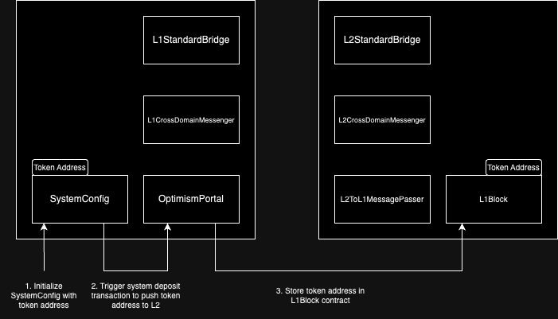
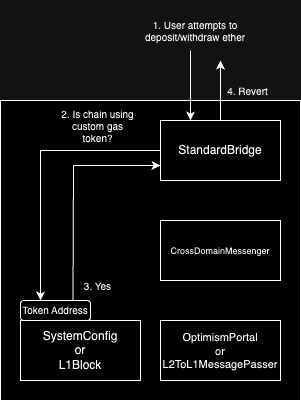

# Custom Gas Token

<!-- START doctoc generated TOC please keep comment here to allow auto update -->
<!-- DON'T EDIT THIS SECTION, INSTEAD RE-RUN doctoc TO UPDATE -->
**Table of Contents**

- [Overview](#overview)
- [Constants](#constants)
- [Properties of a Gas Paying Token](#properties-of-a-gas-paying-token)
- [Configuring the Gas Paying Token](#configuring-the-gas-paying-token)
- [OptimismPortal](#optimismportal)
  - [`depositERC20Transaction`](#depositerc20transaction)
  - [`depositTransaction`](#deposittransaction)
- [StandardBridge](#standardbridge)
- [CrossDomainMessenger](#crossdomainmessenger)
- [User Flow](#user-flow)
- [Security Considerations](#security-considerations)
  - [OptimismPortal Token Allowance](#optimismportal-token-allowance)
  - [Decimal Scaling](#decimal-scaling)
  - [Interoperability Support](#interoperability-support)
  - [Wrapped Ether](#wrapped-ether)

<!-- END doctoc generated TOC please keep comment here to allow auto update -->

## Overview

Custom gas token is also known as "custom L2 native asset". It allows for an ERC20 token to be collateralized on L1
to back the native asset on L2. The native asset is used to buy gas which is used to pay for resources on the network
and is represented by EVM opcodes such as `CALLVALUE` (`msg.value`).

Both the L1 and L2 smart contract systems MUST be able to introspect on the address of the gas paying token to
ensure the security of the system. The source of truth for the configuration of the address of the token is
in the L1 `SystemConfig` smart contract.

## Constants

| Constant          | Value                           | Description |
| ----------------- | ------------------------------- | ----------- |
| `ETHER_TOKEN_ADDRESS` |  `address(0xEeeeeEeeeEeEeeEeEeEeeEEEeeeeEeeeeeeeEEeE)` | Represents ether for gas paying asset |
| `DEPOSITOR_ACCOUNT` | `address(0xDeaDDEaDDeAdDeAdDEAdDEaddeAddEAdDEAd0001)` | Account with auth permissions on `L1Block` contract |
| `GAS_PAYING_TOKEN_SLOT` | `bytes32(uint256(keccak256("opstack.gaspayingtoken")) - 1)` | Storage slot that contains the address and decimals of the gas paying token |

## Properties of a Gas Paying Token

The gas paying token MUST satisfy the standard [ERC20](https://eips.ethereum.org/EIPS/eip-20) interface
and implementation. It MUST be a L1 contract.

The gas paying token cannot:

- Have a fee on transfer
- Have rebasing logic
- Have call hooks on transfer
- Have more than 18 decimals
- Have out of band methods for modifying balance or allowance

It MUST be enforced on chain that the token has 18 or less decimals to guarantee no losses of precision when
depositing a token that has a different number of decimals.

## Configuring the Gas Paying Token

The gas paying token is set within the L1 `SystemConfig` smart contract. This allows for easy access to the information
required to know if an OP Stack chain is configured to use a custom gas paying token. The gas paying token is set
during initialization and cannot be modified until another initialization. It is assumed that the chain operator
will not modify the gas paying token address unless they specifically decide to do so and appropriately handle collateralization.

If the gas paying token address is set to the `ETHER_TOKEN_ADDRESS` then the system is configured to use `ether` as the
native asset on L2. Note that if nothing is stored in state at the `GAS_PAYING_TOKEN_SLOT` then it is considered that
`ether` is used to pay for gas and getters on smart contracts SHOULD return the `ETHER_TOKEN_ADDRESS`.

When the gas paying token is configured in the `SystemConfig`, it kicks off a special deposit transaction that is from the
`DEPOSITOR_ACCOUNT` and calls the `L1Block` contract so that it can store the gas paying token address and its number of decimals
in the L2 system.



## Contract Modifications

### OptimismPortal

The `OptimismPortal` is updated with a new interface specifically for depositing custom tokens.

#### `depositERC20Transaction`

The `depositERC20Transaction` is useful for sending custom gas tokens to L2. It is broken out into its own interface
to maintain backwards compatibility, simplify the implementation and prevent footguns when trying to deposit an
ERC20 native asset into a chain that uses `ether` as its native asset.

```solidity
function depositERC20Transaction(
    address _to,
    uint256 _mint,
    uint256 _value,
    uint64 _gasLimit,
    bool _isCreation,
    bytes memory _data
) public;
```

#### `depositTransaction`

The `depositTransaction` function is updated to revert if there is non-zero `msg.value` when the system uses a custom
native token. This allows existing applications that do cross domain calls to continue functioning as is.

### StandardBridge

The `StandardBridge` contracts on both L1 and L2 MUST be aware of the custom gas token. The `ether` specific ABI on the
`StandardBridge` is disabled when custom gas token is enabled.

This includes the following methods:

- `bridgeETH(uint32,bytes)`
- `bridgeETHTo(address,uint32,bytes)`
- `receive()`

The following diagram shows the control flow for when a user attempts to send `ether` through the `StandardBridge`, either
on L1 or L2.



### CrossDomainMessenger

The `CrossDomainMessenger` contracts on both L1 and L2 MUST not be used to send the native asset between domains.
It is possible to support this in the future, but for now the feature is disabled due to the high probability of footguns.
Using the `CrossDomainMessenger` with a custom gas token would involve modifying the `sendMessage` implementation.

### L1Block

The `L1Block` contract is upgraded with a permissioned function that allows it to set the `GAS_PAYING_TOKEN_SLOT`.
The `DEPOSITOR_ACCOUNT` MUST be the only account that can call the setter function. Any L2 contract that wants
to learn the address of the gas paying token can call the getter on the `L1Block` contract.

## User Flow

Users should deposit native asset by calling `depositERC20Transaction` on the `OptimismPortal` contract.
Users must first `approve` the address of the `OptimismPortal` so that the `OptimismPortal` can use
`transferFrom` to take ownership of the ERC20 asset. If the `transferFrom` fails, a [permit2](https://github.com/Uniswap/permit2)
`transferFrom` is attempted as a fallback.

Users should withdraw value by calling the `L2ToL1MessagePasser` directly.

## Upgrade

The custom gas token upgrade is not yet defined to be part of a particular network upgrade, but it will be scheduled
as part of a future hardfork. On the network upgrade block, a set of deposit transaction based upgrade transactions
are deterministically generated by the derivation pipeline in the following order:

- L1 Attributes Transaction calling `setL1BlockValuesEcotone`
- User deposits from L1
- Network Upgrade Transactions
  - L1Block deployment
  - L2CrossDomainMessenger deployment
  - L2StandardBridge deployment
  - Update L1Block Proxy ERC-1967 Implementation Slot
  - Update L2CrossDomainMessenger Proxy ERC-1967 Implementation Slot
  - Update L2StandardBridge Proxy ERC-1967 Implementation Slot

### L1Block Deployment

- `from`: `0x4210000000000000000000000000000000000002`
- `to`: `null`
- `mint`: `0`
- `value`: `0`
- `gasLimit`: `375,000`
- `data`: TODO
- `sourceHash`: TODO

### L2CrossDomainMessenger Deployment

- `from`: `0x4210000000000000000000000000000000000003`
- `to`: `null`
- `mint`: `0`
- `value`: `0`
- `gasLimit`: `375,000`
- `data`: TODO
- `sourceHash`: TODO

### L2StandardBridge Deployment

- `from`: `0x4210000000000000000000000000000000000004`
- `to`: `null`
- `mint`: `0`
- `value`: `0`
- `gasLimit`: `375,000`
- `data`: TODO
- `sourceHash`: TODO

### L1Block Proxy Update

- `from`: `0x0000000000000000000000000000000000000000`
- `to`: `0x4200000000000000000000000000000000000015`
- `mint`: `0`
- `value`: `0`
- `gasLimit`: `50,000`
- `data`: TODO
- `sourceHash`: TODO

### L2CrossDomainMessenger Proxy Update

- `from`: `0x0000000000000000000000000000000000000000`
- `to`: `0x4200000000000000000000000000000000000007`
- `mint`: `0`
- `value`: `0`
- `gasLimit`: `50,000`
- `data`: TODO
- `sourceHash`: TODO

### L2StandardBridge Proxy Update

- `from`: `0x0000000000000000000000000000000000000000`
- `to`: `0x4200000000000000000000000000000000000010`
- `mint`: `0`
- `value`: `0`
- `gasLimit`: `50,000`
- `data`: TODO
- `sourceHash`: TODO

## Selection of `ETHER_TOKEN_ADDRESS`

It was decided to use `address(0xEeeeeEeeeEeEeeEeEeEeeEEEeeeeEeeeeeeeEEeE)` to represent `ether` to push ecosystem standardization
efforts around using this address to represent `ether` in [DeFi protocols](https://twitter.com/transmissions11/status/1775525755860169010)
or [APIs](https://github.com/ethereum/execution-apis/pull/484).

## Security Considerations

### OptimismPortal Token Allowance

The `OptimismPortal` makes calls on behalf of users. It is therefore unsafe to be able to call the address of the custom gas
token itself from the `OptimismPortal` because it would be a simple way to `approve` an attacker's balance and steal the
entire ERC20 token balance of the `OptimismPortal`.

### Decimal Scaling

A library for scaling `uint256` representations of floating point numbers is used on both ERC20 token deposits and withdrawals.
This ensures that from the point of view of the L2 system, it always appears as if the number of tokens that were deposited
are the same as the native balance. Tokens with less than or 18 decimals are supported, meaning that there is no potential for
loss of precision due to sending in too small of a unit.

### Interoperability Support

Interop is supported between chains that use a custom gas token. The token address and the number of decimals are legible on
chain. In the future we may add the ability to poke a chain such that it emits an event that includes the custom gas token address
and its number of decimals to easily be able to introspect on the native asset of another chain.

### Wrapped Ether

The `WETH9` predeploy at `0x4200000000000000000000000000000000000006` represents wrapped native asset and not wrapped `ether`.
Portable and fungible `ether` across different domains is left for a future project.

## Future Directions

### Enabling a L2 Native ERC20 Token to Pay for Gas

This is an experimental feature and it is not clear if it will ever be included in the OP Stack.
When considering the possibility of using an L2 native ERC20 token to pay for gas, the design constraint
is no diff to the execution layer client. The legacy design of Optimism modified the execution client
such that an ERC20 WETH was used as the native asset. This resulted in a [critical bug][saurik-bug]
that would have allowed infinite minting of `ether` via `selfdestruct`.

[saurik-bug]: https://x.com/saurik/status/1491821215924690950

It may still be possible to use a L2 native ERC20 token to pay for gas given this constraint. The
design could involve modifying the derivation pipeline to accept the previous L2 block's outputs instead
of just the next set of inputs. This would make it more similar to the design of Ethereum's state transition
function.

A simplified design of the Ecotone system:

\\( L2\\_inputs_i = derive(L1\\_data_i) \\)

\\( L2\\_outputs_i = state\\_transition\\_function(L2\\_inputs_i) \\)

Where \\( L1\\_data_i \\) represents a chunk of L1 data containing L2 batches.

Ethereum State Transition Function:

\\( σ\_{t+1} ≡ Υ(σ\_t, T) \\)

Where \\( Υ \\) is the state transition function, \\( σ )\\ is the state at a particular block and \\( T )\\
is the next set of transactions to execute, also known as a block. This is taken directly from the [yellow-paper][yellow-paper].

[yellow-paper]: https://ethereum.github.io/yellowpaper/paper.pdf

Possible future design of Derivation Pipeline:

\\( L2\\_inputs_i = derive(L1\\_data_i, L2\\_outputs\_{i-1}) \\)

\\( L2\\_outputs_i = state\\_transition\\_function(L2\\_inputs_i) \\)

This would enable a design where the derivation pipeline can be aware of mint events from a particular predeploy.
The predeploy could represent an ERC20 wrapped version of the native asset and contain wrapping/unwrapping logic.
The unwrapping logic would result in a future L2 block containing a deposit transaction that mints the native asset.
The wrapping logic would be provably burning the native asset on chain and minting an ERC20 representation of the asset.
Further work needs to be done to determine if such a design is desirable. A version byte in the storage slot meant
to hold the custom gas token address could be used to make the layer the custom gas token is native on.
