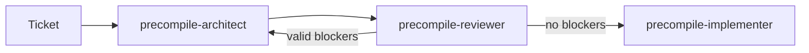

# TDD: Precompile architect eval protocol

| | |
|---|---|
| Status | Harness working end to end. Judge not yet calibrated. No scored run yet. |
| Branch | `toshi/evaluate-precompile-architect` |
| Code | `etc/evals/precompile-architect/` |
| Operator guide | [README.md](README.md) |
| Audience | Reviewers of this eval, and authors of the architect, reviewer and implementer skills |

## 1. Context

We are building three skills that change native precompiles without breaking execution consensus.



The architect turns a ticket into a plan. The reviewer checks the plan and sends valid blockers back. The implementer writes the code. This document covers how the architect is measured. The architect skill does not exist yet. The protocol is written first so the skill is built against a fixed measurement.

### Why consensus makes this hard

Every node re-executes every historical block and must reach the same state root. Precompile logic that a live fork already executed cannot change. The repository versions precompile logic as `logic/v1.rs`, `logic/v2.rs` and so on, routed by `versions.rs`. A shipped version is frozen. New behavior goes into a new version, into a version no network has scheduled, or behind a fork gate. Which of these is correct depends on what is live when the change is made. That is the judgment the architect must get right.

## 2. Goals and non-goals

**Goals**

- Measure whether the skill produces consensus-safe plans more reliably than the same model without it.
- Make a trial's pass or fail unambiguous and reproducible from stored outputs.
- Prevent the agent from reading the answer, through git, config, tools or the network.
- Make every number traceable to a transcript a human can read.

**Non-goals**

- Grading the implementer's code. That is a later end-to-end layer.
- Grading the agent's steps. Only the final plan is graded.
- Grading writing quality or length.

## 3. Terminology

| Term | Meaning |
|---|---|
| Case | One task: ticket, starting commit, upgrade status, expected plan, rubric. |
| Arm | `treatment` has the skill. `control` is the same model and prompt without it. |
| Trial | One sandboxed session for one case and arm. |
| k | Trials per case per arm: 3 for dev, 5 for holdout. |
| Reference solution | The expected plan stored in the case. It must pass its own grader. |
| Hard fail | A consensus-relevant mistake. It fails the trial outright. |
| Critical rubric item | A decision-defining reasoning check. It must be `yes` for the trial to pass. |
| Supporting rubric item | A reasoning check that feeds partial credit only. |

## 4. Architecture

```
cases/*.json (frozen, versioned by case-set SHA)
       |
       v
  RUNNER ---------> GRADER -----------> AGGREGATOR --------> ERROR ANALYSIS
  run.py            grade.py +          report.py            human reads
  case x arm x      judge.py                                 flagged transcripts
  trial, fresh
  sandbox each
       ^                                                     |
       +---- edit the skill (dev cases only) <---------------+
             edit a case only on proven ambiguity, logged
```

| Stage | Input | Output | Properties |
|---|---|---|---|
| Runner | A case, an arm, a trial number | A transcript and a parsed plan block | Stateless, parallel, sandboxed |
| Grader | The case JSON, the plan, the judge verdicts | Pass or fail, hard fails, partial credit | A pure function; re-runnable without the repository |
| Aggregator | All trial records of a run | `report.md` with metrics, intervals and flags | Deterministic, with a fixed bootstrap seed |
| Error analysis | Flagged cases and items | Skill edits, or logged case fixes | Human |

Dev cases drive skill iteration. Holdout cases are scored only at declared milestones.

## 5. Data model

### 5.1 Plan block

The architect ends its reply with one JSON block matching `schemas/plan.schema.json`. Both arms receive the schema verbatim in the harness prompt.

```json
{
  "verdict": "proceed",
  "approach": "new_logic_version",
  "activation_fork": "Denim",
  "versions": { "create": ["V3"], "modify": [], "frozen": ["V1", "V2"] },
  "files": { "create": ["..."], "modify": ["..."], "must_not_modify": ["..."] },
  "symmetric_modules": ["b20_asset", "b20_stablecoin"],
  "surfaces": { "gas": false, "revert_bytes": false, "storage": false, "abi": false, "events": false },
  "tests": { "existing_goldens_unchanged": true, "new": ["..."] }
}
```

The decision has two fields. `verdict` says whether the request is safe as asked. `approach` says how the change reaches the code. A single label had mixed safety with mechanism and was labelled inconsistently.

### 5.2 Case

| Field | Seen by | Purpose |
|---|---|---|
| `ticket`, `base_commit`, `fork_state` | Agent, graders | The task. `fork_state` is computed from chain config at `base_commit`. |
| `expected` | Graders | The reference solution, in plan format. |
| `grading.critical_files` | Code grader | Files a correct plan must touch. Used for recall. |
| `grading.allowed_extra_files` | Code grader | Globs never counted as stray. |
| `grading.alternatives` | Code grader | Other accepted answers for approach, fork and versions. |
| `grading.graded_surfaces` | Code grader | Surface flags scored for partial credit. |
| `rubric[]` with `critical` | Judge, grader | Reasoning checks. Each case has at least one critical item. |
| `reference_commit`, `notes` | Graders | The merged change, and why the label is right. |
| `category`, `polarity`, `split`, `source` | Aggregator | Grouping and train/test separation. |

### 5.3 Labelling convention

A single rule set replaces per-case judgment calls.

- **`activation_fork`** is the earliest fork whose execution differs from the code at `base_commit`, counting forks defined but not scheduled. It is null only when every fork is unchanged. A pre-Beryl fix is therefore labelled `Beryl`.
- **`surfaces`** compares execution at `activation_fork` before and after the change. A call that starts or stops reverting sets only `revert_bytes`. `storage` and `events` count only calls that succeed both before and after.

Applying this convention changed 13 cases:

| Change | Cases |
|---|---|
| `activation_fork` set from null to `Beryl` | 7 pre-Beryl and zeronet cases |
| Surfaces now graded, where they had been skipped as debatable | ERC-8056 implementation, Denim executor policy, factory bootstrap |
| Surfaces corrected | ERC-8056 scaffold, inverted policy IDs, Everest zero-amount burn |

## 6. Dataset

37 cases: 31 historical, 6 synthetic. 23 dev and 14 holdout.

| Era at `base_commit` | Cases | What a correct plan does |
|---|---|---|
| Pre-Beryl | 5 | Edits in place. |
| Beryl live on zeronet only | 2 | Edits in place. The ticket says zeronet is not preserved. |
| Beryl live | 18 | Freezes V1. Restores live V1 only to what networks executed. |
| Cobalt scheduled | 6 | Freezes V2. Denim work goes into V3. |
| Cobalt live | 6 | Rejects V1 and V2 changes. New behavior goes into V4 at Everest. |

| Category | Positive | Negative |
|---|---|---|
| Scaffold, logic only | 6 | 1 |
| Scaffold, logic and ABI | 2 | 2 |
| Gas semantics | 5 | 2 |
| Revert bytes | 6 | 3 |
| Deprecating old code | 2 | 1 |
| Changing old-fork logic | 3 | 4 |

Historical expected files come straight from the merged diff. One merged commit was excluded as a reference. It edited live stablecoin V1 on the false claim that Beryl was zeronet-only, and a later commit reverted it.

## 7. Runner and isolation

`run.py` runs one `claude -p` session per case, arm and trial.

| Leak path | Control |
|---|---|
| Later commits and the reference diff | An empty repo fetches only `base_commit` and its ancestors, then checks out detached. Descendants never exist in the sandbox. |
| Cases and answers | The runner refuses any `base_commit` that contains `etc/evals/`. |
| User memory, skills, settings | A fresh `CLAUDE_CONFIG_DIR` per trial. Treatment installs only the skill under test. |
| MCP servers such as Sourcegraph, Glean, Linear | `--strict-mcp-config` with an empty config. |
| Web and network lookups | No web tools. Bash runs sandboxed with an empty network allowlist and no unsandboxed retry. |
| File writes | Edit and Write are disallowed. |

The network block was verified in a headless trial. A sandboxed `curl` to GitHub failed with a 403 from the sandbox proxy.

Machine-wide managed hooks still load. They apply equally to both arms. Built-in Claude Code skills also load in both arms. None of them covers precompiles or consensus.

## 8. Grading

### 8.1 Pass rule

```
pass = no hard fail
       AND every exact-match check passes
       AND every critical rubric item is yes
```

### 8.2 Hard fails

| Hard fail | Condition |
|---|---|
| `touches_frozen` | Create or modify lists a must-not-modify file. |
| `verdict_mismatch` | Proceeds where reject is expected, or rejects a safe request. |
| `missing_frozen_version` | A proceed plan omits a version the case expects frozen. |
| `format_failure` | No parseable, schema-valid plan block. |

`missing_frozen_version` does not apply to rejects, because a reject touches nothing. The first smoke run showed why. A correct rejection with an empty frozen list was failing on a technicality.

### 8.3 Exact-match checks

- `approach`, `activation_fork`, `versions.create` and `versions.modify` must match the expected answer or one alternative, all fields together.
- `symmetric_modules` must be a superset of the expected list.

### 8.4 Partial credit

Partial credit is reported for every trial but never decides a pass.

| Dimension | Score |
|---|---|
| Surfaces | Share of graded flags that match. |
| File recall | Share of critical files touched. |
| File precision | Share of touched files that are expected or allowed. |
| Frozen coverage | Mean of must-not-modify file coverage and frozen version coverage. |
| Supporting rubric | Share of supporting items judged `yes`. |

### 8.5 Leniency

- **Normalization.** Paths and version names are normalized.
- **Plumbing is free.** `lib.rs`, `mod.rs`, test files and fakes never count as stray.
- **Format repairs.** Omitted empty fields are repaired and logged. A missing verdict is never repaired.
- **Alternatives.** Cases list alternatives where experts would accept more than one answer.

### 8.6 Proving the grader

- **Reference solutions.** `validate_cases.py` requires every reference solution to pass its own grader with full partial credit.
- **Self-tests.** `test_grader.py` has 22 tests. Known-wrong plans must fail, and valid variations must pass. They cover:
  - each hard fail
  - an unknown on a critical item
  - a missing symmetric module
  - an alternative matched on only some of its fields
  - stray files
  - wrong surfaces
  - formatting differences

## 9. LLM judge

| Property | Choice | Reason |
|---|---|---|
| Model | `claude-opus-5`, fixed, separate from the architect | Stable across runs, and at least as strong as the agent. |
| Sampling | Temperature 0, direct Messages API call | Reproducible verdicts. |
| Granularity | One call per rubric item | One criterion cannot bias another. |
| Blinding | Never told the arm | Removes arm bias. |
| Inputs | Ticket, upgrade table, expected plan, notes, criterion, full final reply | Consensus correctness needs the known-good answer. |
| Output | `yes`, `no` or `unknown`, plus a quote and a reason | Every verdict is checkable. |
| Errors | Retried three times. A critical item still in error blocks a pass. | Transport noise never decides a trial. |

**Unknown.** `unknown` means the plan never addresses the item. The prompt requires `yes` or `no` whenever the plan takes a position.

| Situation | Treatment of `unknown` |
|---|---|
| Critical item | Fails the trial. A missing safety argument is a missing argument. |
| Supporting item | Scores 0 in partial credit. |
| Reporting | Counted separately, never folded into `no`. |
| Above 20% on one item across arms | Flags the item as ambiguously worded. |
| A gap above 20 points between arms | Flagged. One arm's plans are omitting their reasoning. |

A live check showed the distinction working on the same case. A plan that explained why V1 must stay got `yes`. A bare "reject" got `unknown` on the same item.

### 9.1 Calibration

Calibration is required before any scored run.

- **Label a set by hand.** Label about 30 case and plan pairs with the same three values. Include injected flaws, borderline plans, and plans that omit an item.
- **Agreement target.** Require at least 90% per-item agreement, counting all three values.
- **Track unknown fallback.** Count how often the judge says `unknown` where the human decided.
- **Re-calibrate.** Do it again when the judge model or a rubric changes.

## 10. Metrics

| Metric | Definition | Use |
|---|---|---|
| pass^k | C(c,k)/C(n,k) per case, averaged over cases | Primary. Consensus safety needs every attempt to be right. |
| pass@k | 1 − C(n−c,k)/C(n,k) | Context. Shows capability ceiling. |
| 95% CI | Bootstrap over cases, 10,000 resamples | Uncertainty on each arm. |
| Paired delta | Per-case treatment minus control pass rate, with a bootstrap CI | The skill effect. Claimed only if the CI excludes zero. |
| Sign test | Exact two-sided, over cases | Secondary check on the paired delta. |
| Breakdowns | Category, polarity, decision | Where the skill helps or hurts. |

| Split | k | Sessions per arm |
|---|---|---|
| Dev | 3 | 69 |
| Holdout | 5 | 70 |

A full run of both splits and both arms is 278 sessions. With 14 holdout cases, only large effects are detectable.

**Sanity flags** in the report:

- A case at 0% in every arm, which suggests a broken or ambiguous task.
- A case at 100% in every arm, which means it is saturated.
- Unknown-rate flags on rubric items.
- Format failures and infra errors, counted apart from agent failures.

## 11. Result record

Each trial writes `results/<run_id>/<case_id>/<arm>/trial-<n>.json` with the raw transcript beside it. A record holds:

- case id, arm, trial and split
- architect model ids, judge model id and Claude Code version
- skill SHA and case-set SHA
- timestamp and transcript path
- the parsed plan, format repairs and grader output
- per-item judge verdicts with reasons
- cost, turns and elapsed time

Holdout runs require `--milestone` and append to `holdout_log.jsonl`.

## 12. Current status

A two-case control-arm smoke run passed through every stage. It used Haiku as the architect and Opus as the judge.

| Case | Result | What it showed |
|---|---|---|
| Delete V1 at the latest commit | Pass after a grader fix | The plan correctly rejected but left the frozen list empty. That exposed the reject rule in 8.2. One judge call returned an empty reply, which led to the retries in section 9. |
| Cobalt permit metering | Fail | Haiku created a V3 at Denim instead of editing the unshipped V2 at Cobalt. The exact-match checks caught it. The judge passed both rubric items. That is consistent, because the rubric asks only about V1 and symmetry. |

## 13. Risks

- **The judge is uncalibrated.** Its verdicts are not yet evidence.
- **The judge sees the expected plan.** That improves accuracy but can anchor it on the merged approach. Calibration must include valid alternatives.
- **Self-preference.** The judge and architect are the same model family.
- **Hand labels.** Each case is labelled by one person. The synthetic cases have no merged change behind them. Surfaces stay partial credit until a second review.
- **Shared hooks and built-in skills.** They load in both arms. They are equal across arms but differ from a bare model.
- **Small holdout.** 14 cases cannot detect small effects.
- **Pinned synthetic base.** The synthetic cases use a pinned commit. Re-pinning means re-checking their labels against the new fork set.

## 14. Open questions

1. Should restoring live code to what networks executed be its own approach, separate from editing in place?
2. Should the judge stay unblinded to the expected verdict on synthetic cases?
3. Is the 20% unknown threshold right for items that appear in only a few trials?

## 15. Follow-ups

- Build the calibration set and record agreement.
- Get a second labeller, then promote `surfaces` to an exact-match check.
- Add an end-to-end layer: a fixed implementer turns each plan into code, then the golden suites run.
- Reuse the harness for the reviewer, with recall on seeded plan flaws and a false-blocker rate on clean plans.
